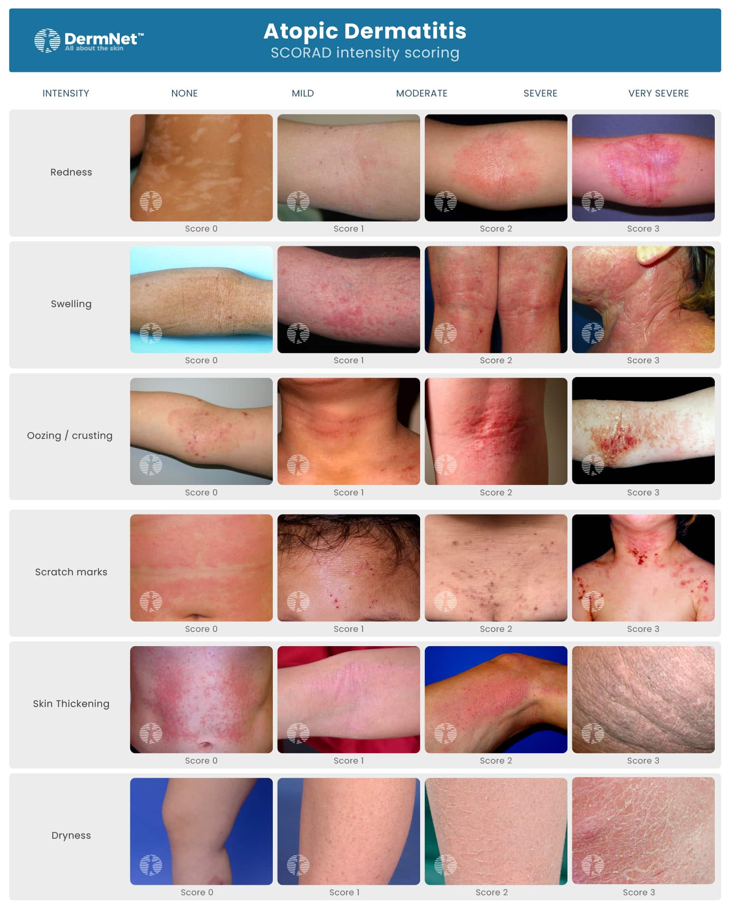
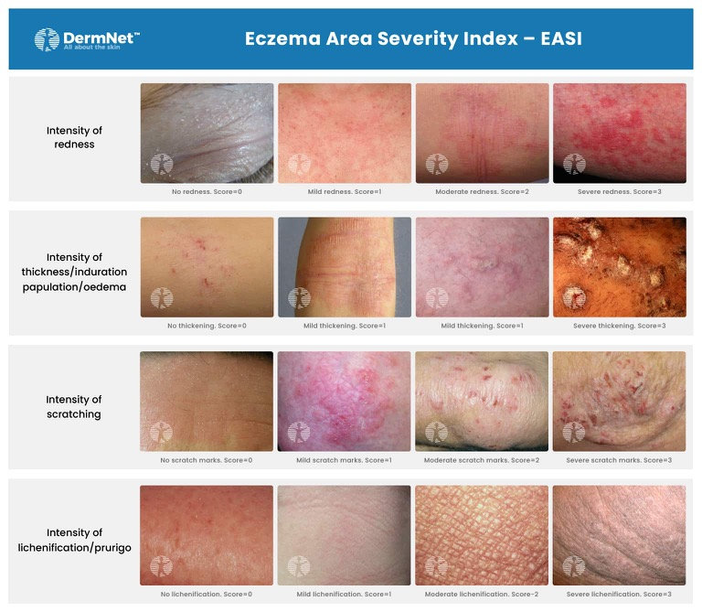

# AD 疾病活性評估工具：SCORAD vs EASI 比較

> **線上 SCORAD 計算器**：[scorad.corti.li](https://scorad.corti.li/)

## 一、總覽比較表

| 項目 | **SCORAD** | **EASI** |
|---|---|---|
| 全名 | SCORing Atopic Dermatitis | Eczema Area and Severity Index |
| 發表 | European Task Force on Atopic Dermatitis, 1993 | Hanifin et al., 2001 |
| 組成邏輯 | **A（範圍）+ B（客觀徵象強度）+ C（主觀症狀）** 三部分加權相加 | 僅計算**客觀徵象**（範圍係數 × 徵象嚴重度），**不含主觀症狀** |
| A：侵犯範圍 | 依 Rule of Nines 估算 % BSA，總分 0–100，公式中取 **A/5** | 四個體區分別以面積係數（0–6 分，對應 0–100% 侵犯比例分級）計算，**非直接用 BSA %** |
| B：客觀徵象 | 6 項：紅斑、水腫/丘疹、滲出/結痂、抓痕、苔癬化、乾燥，各 0–3 分（乾燥於非病灶處評估），總分 0–18，公式中取 **7B/2** | 4 項：紅斑、丘疹/浸潤（induration/papulation）、抓痕、苔癬化，各 0–3 分；**無乾燥項目** |
| 身體分區 | 不分區，全身統一評估徵象嚴重度 | 分 4 大區：頭頸、軀幹、上肢、下肢，**各區獨立評分後加總**；成人與 <8 歲兒童的區域權重不同（兒童頭部權重較高、下肢較低，反映體表比例差異） |
| C：主觀症狀 | 癢（pruritus）與失眠（sleep loss），各以 VAS 0–10 分，總分 0–20 | **無此項目** |
| 計算公式 | SCORAD = A/5 + 7B/2 + C | EASI = Σ（各區：4 項徵象總分 × 面積係數 × 區域權重係數） |
| 總分範圍 | 0–103 | 0–72 |
| 嚴重度分級（常用切點） | 輕度 <25、中度 25–50、重度 >50 | 幾乎清除 0.1–1.0、輕度 1.1–7、中度 7.1–21、重度 21.1–50、極重度 >50 |
| 變化型 | **Objective SCORAD**（拿掉 C 項，僅 A+B，用於無法自評的嬰幼兒或需排除主觀偏差的情境） | **EASI-75 / EASI-90**：達到較基準值下降 75%／90% 的比例，是目前**生物製劑臨床試驗（如 dupilumab）最常用的療效指標** |
| 優點 | 唯一納入癢與睡眠等病人自覺症狀，較貼近生活品質衝擊 | 純客觀評分，觀察者間信度（inter-rater reliability）較佳，且分區設計對局部嚴重、局部輕微的不對稱病灶更敏感 |
| 缺點 | 含主觀項目，評分者間變異度較大；未分身體區域，對局部嚴重病灶的敏感度較低 | 未評估癢/睡眠等病人感受；乾燥（xerosis）未列入評分項目 |
| 主要使用情境 | 臨床試驗（尤其歐洲）、需同時反映生活品質時 | 目前**全球生物製劑臨床試驗最主流**的療效終點指標（如 dupilumab、tralokinumab 試驗均以 EASI-75 為主要療效指標） |

## 二、記憶口訣

- **SCORAD** 有「3 個字母」= **A**rea + **B**（客觀）+ **C**（主觀，Cry/Comfort：癢與睡眠）→ 是唯一同時問「病人感受」的量表。
- **EASI** 只看「4 個部位 × 4 個徵象」，**沒有乾燥、沒有癢**，是**純醫師評分**工具，故常用於需要高觀察者間一致性的**藥物臨床試驗**（EASI-75 已成為業界標準終點）。

---

**出處**：European Task Force on Atopic Dermatitis. Severity scoring of atopic dermatitis: the SCORAD index. Dermatology 1993;186:23–31；Hanifin JM, Thurston M, Omoto M, et al. The eczema area and severity index (EASI). Exp Dermatol 2001;10:11–18（兩篇文獻於 Middleton's Allergy 9E Ch33 中被引用為 AD 嚴重度評分工具，惟原文未詳述計分細節，本表內容整理自 SCORAD/EASI 原始發表文獻之標準計分架構）。
