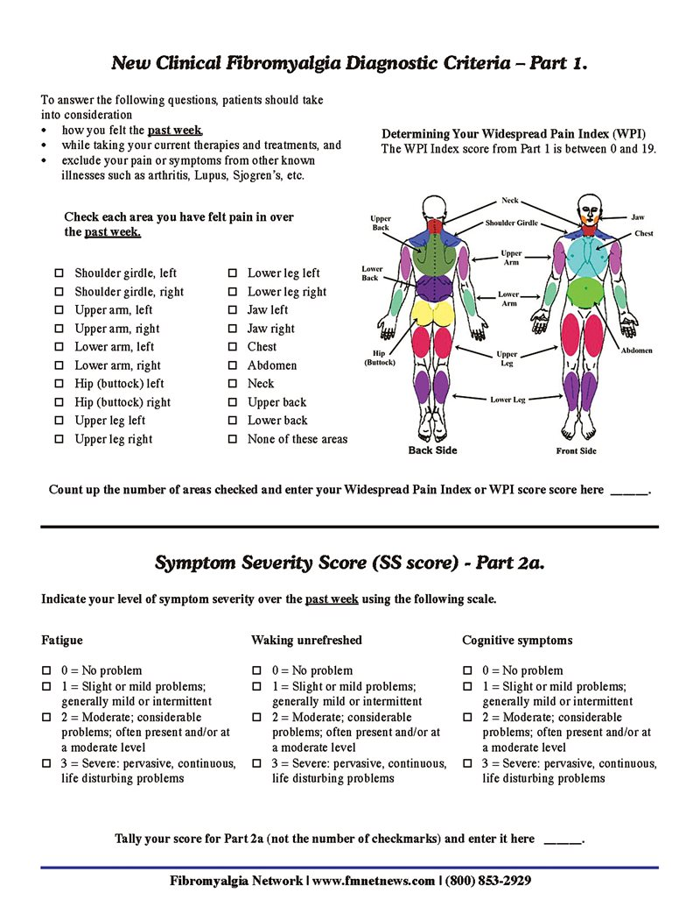

# 纖維肌痛症（Fibromyalgia, FM）— 分類與診斷標準

## 核心概念

- FM 診斷**完全依賴病人自述**，沒有客觀實驗室或影像可確診。
- 所有經驗證標準的共同必要條件：**慢性、廣泛的肌肉骨骼疼痛**。
- 標準演變：**ACR 1990 → 2010 初步 → 2011 修訂 → 2016 修訂版（現行主流）**。

---

## 臨床診斷問卷（WPI＋SS score）

> 上圖：左半為 **WPI 身體圖**（前側 Front／背側 Back，共 19 區，勾選過去一週疼痛部位，計 0–19）；下半為 **Part 2a 症狀嚴重度**（疲倦、睡醒不解乏、認知症狀，各 0–3）。

---

## 一、ACR 1990 分類標準（舊版，著重壓痛點）

兩條件須同時符合：

1. **廣泛性疼痛**：左右兩側、腰部上下、且含中軸（neck/back/chest）。
2. **壓痛點檢查**：18 個指定點中至少 **11 個**壓痛（力道≈拇指甲壓到變白）。

**限制 →** 男女偵測差異、未納入疲倦/睡眠等症狀，故**壓痛點檢查現已少用**。

---

## 二、2010 / 2011 標準

- **取消理學檢查**，改以病人自述。
- 引入 **WPI** 與 **SSS** 兩量表。
- 批評：失去「疼痛須廣泛」要求，可能擴大盛行率、偏向身體症狀障礙者。

---

## 三、2016 修訂版（現行主流，Kelly Table 52.1）

### 診斷條件（三項須同時符合）

1. **WPI ≥ 7 且 SSS ≥ 5**，**或** **WPI 4–6 且 SSS ≥ 9**
2. **廣泛性疼痛**：5 區中至少 **4 區**有疼痛
   - ⚠️ 下顎、胸、腹**不計入**廣泛性定義
3. 症狀**持續 ≥ 3 個月**
4. FM 診斷**不因合併其他疾病而排除**。

### 廣泛疼痛指數（WPI）：0–19

五大分區與所含部位：

| 分區 | 包含部位 |
|---|---|
| 右上區（Region 1） | 下顎R、肩帶R、上臂R、下臂R |
| 左上區（Region 2） | 下顎L、肩帶L、上臂L、下臂L |
| 右下區（Region 3） | 髖/臀R、上腿R、下腿R |
| 左下區（Region 4） | 髖/臀L、上腿L、下腿L |
| 中軸區（Region 5） | 頸、上背、下背、胸、腹 |

### 症狀嚴重度量表（SSS）：0–12

A. 核心 3 症狀，各 0–3 分（合計 0–9）：

- 疲倦（Fatigue）
- 睡醒不解乏（Waking unrefreshed）
- 認知症狀（Cognitive symptoms）

> 0＝無；1＝輕微/間歇；2＝中度；3＝嚴重、持續、影響生活

B. 過去 6 個月以下症狀，各 0–1 分（合計 0–3）：

- 頭痛
- 下腹疼痛或絞痛
- 憂鬱

→ **SSS = A（0–9）＋ B（0–3）= 0–12**

**纖維肌痛嚴重度量表（FS scale）= WPI ＋ SSS**（可作疾病活動度指標）

**練習題（自製，非考古題）：**

45 歲女性，全身廣泛疼痛持續 4 個月。

- Fatigue：severe（3）
- Waking unrefreshed：moderate（2）
- Cognitive symptoms：mild（1）
- 過去 6 個月頭痛：有（1）
- 過去 6 個月下腹疼痛或絞痛：無（0）
- 過去 6 個月憂鬱：有（1）

→ Part A = 3+2+1 = 6；Part B = 1+0+1 = 2；**SSS = 6 + 2 = 8**

### ACR 1990 vs 2016 對照

| 面向 | ACR 1990 | 2016 修訂版（2010/2011 修訂） |
|---|---|---|
| 性質 / 用途 | 分類標準（研究用） | 診斷標準（臨床可用） |
| 核心疼痛要求 | 廣泛性疼痛：左右兩側＋腰部上下＋中軸 | 廣泛性疼痛：5 區中 ≥4 區（下顎/胸/腹不計） |
| 理學檢查 | **需要**：18 壓痛點取 ≥11 點壓痛 | **取消**，純病人自述 |
| 量化工具 | 無（僅靠壓痛點數） | **WPI（0–19）＋ SSS（0–12）** |
| 其他症狀 | 未納入 | 納入：疲倦、睡醒不解乏、認知、頭痛、下腹痛、憂鬱 |
| 病程要求 | ≥ 3 個月 | ≥ 3 個月 |
| 診斷切點 | ≥11/18 壓痛點 | WPI≥7 且 SSS≥5　或　WPI 4–6 且 SSS≥9 |
| 與他病並存 | 診斷不受其他疾病影響 | 明文：合併其他疾病不影響診斷 |
| 主要侷限 | 壓痛點檢查男女偵測有差異、未含疲倦/睡眠等症狀 | （2010/2011 曾失去「廣泛性」要求 → 2016 修回） |

> **演變脈絡**：1990 重「壓痛點」→ 2010/2011 改「病人自述＋症狀量表」但放寬廣泛性 → 2016 修回「需 ≥4 區廣泛分布」，兼顧症狀量化與疼痛分布。

---

## 四、ICD-11 分類定位

FM 屬 **慢性原發性疼痛（chronic primary pain）** 下的 **慢性廣泛性疼痛**亞型。其餘四亞型：CRPS、慢性原發性頭痛/口顏面痛、慢性原發性內臟痛、慢性原發性肌肉骨骼痛。

---

## 五、重點提醒（考試常考）

- 切點：`WPI≥7 + SSS≥5` **或** `WPI 4–6 + SSS≥9`。
- 廣泛性疼痛＝**5 區中 ≥4 區**，**下顎/胸/腹不算**。
- **WPI 計 19 區（含下顎）** vs **廣泛性疼痛用 5 區（不含下顎/胸/腹）** — 兩套不同用途，勿混。
- 症狀 **≥3 個月**；FM **可與其他疾病並存**。
- 常合併的疼痛放大症候群：顳顎障礙、張力性/偏頭痛、腸躁症、間質性膀胱炎、痛經/骨盆痛、外陰痛。

---

*資料來源：Firestein & Kelley's Textbook of Rheumatology, Ch.52；問卷圖：Fibromyalgia Network (fmnetwork.com)*
