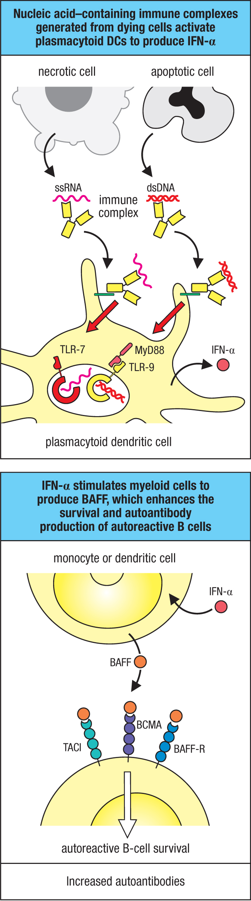

# Type I Interferon：細胞來源、pDC 活化機轉與 SLE Pathogenesis

## 1. Monocyte、Macrophage、Dendritic Cell 的來源與功能

### 共同起源

三者都主要來自骨髓的 common myeloid progenitor (CMP)，同屬 mononuclear phagocyte system。但少數組織巨噬細胞（如中樞神經系統的 microglia）例外，是在胚胎期由 yolk sac/fetal liver 而來，出生後獨立自我更新，不再依賴骨髓來源的 monocyte 補充。

### 來源與分化路徑差異

| | 來源 | 分化去向 |
|---|---|---|
| **Monocyte** | 骨髓 CMP → 血液中循環的前驅細胞 | 本身不是最終分化型態；進入組織後可分化成 macrophage 或 monocyte-derived DC（MoDC） |
| **Macrophage** | (1) 胚胎期 yolk sac/fetal liver 直接分化，終生自我更新（如 microglia, Kupffer cell, alveolar macrophage）；(2) 成人期由血中 monocyte 進入組織後分化而來 | 長壽命的組織駐留細胞，遍布幾乎所有組織 |
| **Dendritic cell (cDC)** | 大多由 CMP 經 DC 前驅細胞分化，直接由骨髓產生（並非由 monocyte 分化而來，這是常見誤解）；少數可能源自 common lymphoid progenitor | 未成熟時駐留在 barrier tissue（皮膚、腸道、肺），遇到病原後成熟並遷移到淋巴組織 |

### 功能差異

三者都屬於吞噬細胞，但主要任務不同：

- **Macrophage**：長期組織駐留的「清道夫」，功能偏向**效應端**——吞噬並殺死微生物、清除死細胞殘骸、分泌發炎介質（cytokines/chemokines）啟動並放大發炎反應。也能呈現抗原給已活化的 effector/memory T 細胞（例如接受 T~H~1 cell 訊號而被活化去殺死胞內菌），但**活化 naive T 細胞的能力遠不如 DC**。
- **Dendritic cell**：功能偏向**橋接 innate 與 adaptive immunity**——未成熟時大量吞噬（phagocytosis + macropinocytosis）並偵測病原，一旦活化就下修吞噬能力、上調 MHC 與 co-stimulatory molecule（CD80/CD86），遷移到淋巴結 T-cell zone，是唯一能有效活化 **naive T cell** 的專業 APC。
- **Monocyte**：血液中的過渡族群，本身吞噬能力也強，但主要角色是在發炎時被 chemokine 招募進入組織，補充/放大局部 macrophage 或分化成 MoDC 的「儲備部隊」。

一句話總結：Macrophage 是「常駐處理站」，DC 是「情報兵，負責把抗原送到淋巴結啟動 T 細胞」，Monocyte 是「循環中的補充兵，進組織才分化成前兩者之一」。

## 2. Myeloid (Conventional) DC 與 Plasmacytoid DC 的差異

Dendritic cell 分兩大類：**conventional/classical DC (cDC，即 myeloid DC)** 與 **plasmacytoid DC (pDC)**，兩者角色分工明顯不同。

| 特徵 | cDC (myeloid DC) | pDC |
|---|---|---|
| 型態 | 典型樹突狀突起 | 形似漿細胞（plasma cell），故稱 plasmacytoid |
| 主要功能 | **活化 naive T 細胞**（antigen presentation 為主） | **偵測病毒感染，分泌大量 type I interferon (IFN-α)**，活化 naive T 細胞能力很弱 |
| 抗原處理/呈現能力 | 強（macropinocytosis + phagocytosis，MHC I/II 呈現效率高） | 弱 |
| 主要 TLR | 幾乎涵蓋所有 TLR（TLR-3 等偵測胞外/胞內訊號） | 主要表現**胞內** TLR-7、TLR-9（辨識病毒 ssRNA、CpG DNA） |
| 又細分亞群 | **cDC1** 與 **cDC2** | 無此細分 |

### cDC1 vs cDC2（cDC 內部再分兩型，功能互補）

| | cDC1 | cDC2 |
|---|---|---|
| 專一表面標記 | XCR1、CLEC9A、BDCA-3 | CD11b、BDCA-1、Dectin-1 |
| 關鍵轉錄因子 | BATF3、IRF8 | Notch2、IRF4 |
| TLR-3 | 表現（偵測 dsRNA） | 不表現 |
| 主要分泌 cytokine | IL-12 | IL-23、IL-6、TGF-β |
| 主要活化對象 | **naive CD8 T cell**（cross-presentation 能力強，抗胞內病原/抗腫瘤監視關鍵） | **naive CD4 T cell**（誘導 T~H~17、T~H~2、T~FH~ 分化） |
| 對應病原型態 | 胞內病原（病毒等） | 胞外病原 |

pDC 是「type I interferon 生產專家」（過去也稱 interferon-producing cell, IPC），透過 TLR-7/TLR-9 辨識病毒 RNA/DNA 後大量分泌 IFN-α/β，抗病毒功能顯著，但呈現抗原活化 naive T 細胞的能力遠不如 cDC。這也是 pDC 在 SLE 等自體免疫疾病 pathogenesis 中扮演重要角色的機轉基礎（持續產生 type I IFN 驅動 IFN signature）。

### TLR3：cDC1 也會產生 type I IFN（TRIF-IRF3 路徑，與 pDC 的 MyD88-IRF7 路徑不同）

pDC 不是唯一能產生 type I IFN 的 DC——**cDC1** 透過 **TLR3** 也能誘導 type I IFN，但走的是完全不同的 adaptor/IRF。

**主要表現細胞**：

- **Macrophage**
- **Conventional dendritic cell**，尤其是 **cDC1** 亞群——TLR-3 是區別 cDC1 與 cDC2 的關鍵標記之一（cDC2 不表現 TLR-3）
- **腸道上皮細胞（intestinal epithelial cell）**

（TLR3 位於 **endosome**，需要 **UNC93B1** 這個 12-次跨膜蛋白幫忙從內質網轉運到 endosome，這點與 TLR7/8/9 相同。）

**辨識的配體**：**dsRNA (double-stranded RNA)**，來源可以是：

1. 本身基因體就是 dsRNA 的病毒（如 rotavirus）直接被胞吞後在 endosome 中偵測到；
2. ssRNA 病毒**複製過程中**產生的 dsRNA 中間產物；
3. 連 **DNA 病毒**（如 herpes simplex virus）也能被 TLR3 偵測到——機轉是病毒基因體上正負股重疊轉錄（overlapping transcription）產生了 dsRNA。

**訊息傳遞路徑**（與 TLR7/8/9 不同，這條走 **TRIF，不經 MyD88**）：

```
TLR3 + dsRNA → TRIF → TRAF3 → TBK1/IKKε → IRF3 磷酸化
     → IRF3 入核 → 轉錄 type I IFN（主要 IFN-β）
```

與 pDC 的「MyD88 → IRAK1 → IRF7」路線是**兩條獨立產生 type I IFN 的路徑**：TLR3 用 TRIF-IRF3，TLR7/9（在 pDC）用 MyD88-IRF7，adaptor、IRF 家族成員、主要細胞完全不同。

**功能意義**：在 cDC1 上，TLR3 的表現與其「專責活化 naive CD8 T 細胞、cross-presentation、對付胞內病原（尤其病毒）」的角色一致——偵測到 dsRNA 代表細胞正遭受病毒複製，適合啟動抗病毒的 CD8 T 細胞反應。在腸道上皮細胞上，則提供黏膜屏障對腸道病毒（如 rotavirus）的第一線偵測。

**臨床鉤子（與 MyD88/TLR7/9 路線的鑑別考點）**：**TLR3（或其上游 UNC93B1）loss-of-function mutation** 與**反覆單純疱疹病毒腦炎（HSE, herpes simplex encephalitis）**相關——儘管 HSV 是 DNA 病毒。這類病人對其他病毒的免疫力大致正常（其他病毒感應器可代償），顯示 **TLR3 路徑在中樞神經系統的局部抗病毒防禦中特別關鍵**，可與「MyD88/IRAK4 缺乏 → 反覆化膿菌感染、發燒反應減弱」互為鑑別選項。

### 2-3 Type I IFN（IFN-α/β）產生細胞總覽（速記表）🔴

原則：幾乎所有細胞受病毒感染、活化 RLR（RIG-I/MDA5）或 cGAS-STING 後都能產生 type I IFN，但有兩種細胞特別專精：

| 細胞 | 路徑 | 特點 |
|---|---|---|
| **pDC（plasmacytoid DC）**🔴 | TLR-7/9（endosome）→ MyD88 → **IRF7** | 「專業 IFN 生產細胞」（過去稱 interferon-producing cell, IPC）。因**組成性高量表現 IRF7**，產量可達其他細胞的 **1000 倍**，是 type I IFN 的主力，也是 SLE「干擾素印記」的分子根源 |
| **cDC1** | TLR-3（endosome，偵測 dsRNA）→ TRIF → **IRF3** | 與 pDC 走完全不同 adaptor/IRF；cDC2 不表現 TLR-3 |
| 巨噬細胞、腸道上皮細胞 | 同上 TLR-3/TRIF/IRF3，或胞質 RLR/cGAS-STING | 一般細胞的補充來源 |
| 幾乎所有有核細胞 | 胞質 RIG-I/MDA5→MAVS 或 cGAS→STING | 病毒感染時的普遍反應，非專職但普遍存在 |

在 SLE 情境下，除了 pDC，放大迴路還涉及其他 IFN 來源：neutrophil（NETosis）、platelet（CD40L 刺激 pDC）、M1 macrophage、keratinocyte（分泌 IFN-κ）——詳見下方第 4-4 節。

## 3. IFN 作用機轉：受體訊息傳遞與對「一般細胞」的效應

pDC／cDC1 產生 IFN-α/β 之後，並不是只作用在少數免疫細胞——因為**幾乎所有有核細胞都表現 IFNAR**，這是 IFN 效應範圍如此廣、也是 SLE「IFN signature」能在周邊血幾乎任何白血球族群都測到的根本原因。

### 3-1 受體與訊息傳遞：IFNAR → JAK/STAT → ISGF3 🔴

```
IFN-α/β 結合共同受體 IFNAR（IFNAR1+IFNAR2）
        ↓
Tyk2（接 IFNAR1）＋ Jak1（接 IFNAR2）磷酸化
        ↓
STAT1 ＋ STAT2 磷酸化
        ↓
與 IRF9 組成 ISGF3 複合體
        ↓
進核結合 ISRE（interferon-stimulated response element）
        ↓
轉錄數百個 ISG（interferon-stimulated gene）
```

### 3-2 對一般細胞的效應（生理層面，非侷限於免疫細胞）🔴

| 效應 | 機轉／代表分子 | 意義 |
|---|---|---|
| **抗病毒狀態** | **OAS**（合成 2′,5′-oligoadenylate → 活化 RNase 降解病毒 RNA）、**PKR**（磷酸化 eIF2α → 抑制轉譯）、**Mx proteins**（GTPase，抑制病毒複製）、**IFIT**（阻斷 eIF3，抑制轉譯起始）、**IFITM**（阻擋病毒膜與 lysosome/endosome 融合） | 讓周邊未感染細胞提前進入「防禦狀態」，抑制病毒複製 |
| **上調 MHC class I** | 幾乎所有細胞類型 | 雙重意義：一方面增加對 NK cell 攻擊的抵抗力，另一方面被感染細胞 MHC I 上調反而更容易被 **CD8 CTL** 辨認殺死 |
| **活化 NK cell** | 直接活化 | 增強 NK 對受感染細胞的毒殺能力 |
| **誘導 chemokine** | **CXCL9、CXCL10、CXCL11** | 招募淋巴細胞到感染／發炎部位 |
| **細胞內在的正回饋（自我放大）**🔴 | IFN-β 誘導細胞更容易表現 **RIG-I、MDA-5、IRF7、STING** | 這些本身也是 ISG，被誘導後使細胞對病毒核酸更敏感、更容易再產生 IFN-α，形成**細胞內在**的放大迴路（與下方 4-4 節 pDC/NET 的**細胞間**放大迴路是兩個不同層次） |

### 3-3 常見疑問：MHC class I 上調不會降低 NK cell 毒殺能力嗎？🔴

NK cell 是否毒殺一顆目標細胞，取決於 **activating receptor** 與**辨識 MHC class I 的 inhibitory receptor（KIR-L、CD94/NKG2A 等，走 ITIM）**兩者訊號的相對強弱——MHC I 越多，inhibitory 訊號越強，這顆細胞越不容易被殺，這點沒有錯。但這不代表「type I IFN 全面上調 MHC I」會讓 NK cell 整體失去戰力，因為 IFN 同時做了**兩件作用對象不同的事**：

- **對「目標細胞」端**：誘導 MHC I 上調 → 保護這顆（通常是未感染或已呈現抗原的）健康細胞不被 NK 誤殺
- **對「NK cell」本身**：IFN-α/β **直接活化 NK cell**（與目標細胞的 MHC I 表現量無關），殺傷力可提升 **20–100 倍**（Janeway Ch03, 3-24），加上巨噬細胞/DC 分泌的 IL-12/IL-18 協同活化

Janeway 原文（Ch03, Section 3-26）明確點出這個雙軌設計：「Interferons induce expression of MHC class I molecules and protect uninfected host cells from being killed by NK cells, **while also activating NK cells to kill virus-infected cells**.」

**這解釋了病毒的兩難（trade-off dilemma）**：

- 若被感染細胞乖乖跟著上調 MHC I（未演化出下調能力）→ 雖躲過 NK，但 MHC I 呈現病毒抗原，反而更容易被 **CD8 CTL** 辨認殺死（見上表「上調 MHC class I」列的雙重意義）
- 若病毒**主動下調 MHC I** 來躲避 CTL（如 HSV、CMV、HIV Nef 等常見免疫逃逸策略）→ 這顆細胞的 MHC I 遠低於周圍被 IFN 誘導上調的健康細胞 → inhibitory 訊號大減（**missing self**）→ 加上此時 NK cell 已被 IFN 活化、活化閾值降低 → 更容易被辨認殺死

一句話：type I IFN 不只是「調高保護門檻」，同時「調低 NK 活化閾值」，兩者同步發生，讓病毒無論選擇維持或下調 MHC I 都難逃——維持則死於 CTL，下調則死於（已活化的）NK。

🔴 一句話銜接：正常生理下，這套機制是全身性的抗病毒防禦網；但在 SLE，因為刺激源（自身核酸）持續存在、不會像病毒感染一樣清除，這套原本用來抗病毒的廣泛效應被**慢性、全身性地誘發**，於是轉為致病機轉（見下第 4 節）。

## 4. pDC 與 SLE 的 Type I IFN Pathway


這是 SLE pathogenesis 的核心機轉，也是近年最重要的治療標的（anifrolumab 已上市）。以下依「上游刺激 → pDC 活化 → 下游放大」的順序整理。

### 4-1. 上游：為什麼會有持續的 nucleic acid 刺激？

SLE 病人的 apoptotic cell debris 清除有缺陷（尤其 **complement C1q、C2、C4 缺乏**是單基因 SLE 中風險最高的族群），導致核酸相關的自身抗原（DNA、RNA、核蛋白如 Ro/La/Sm/RNP）持續存在，並與對應的自體抗體結合形成 **nucleic acid–containing immune complex**。

**C1q 的雙重角色**特別值得記：C1q 除了幫助清除 apoptotic debris，還會把這些 immune complex **導向 monocyte 而非 pDC** 處理；C1q 缺乏時，immune complex 轉而優先進入 pDC，直接放大 IFN-α 的產生。

### 4-2. pDC 活化：TLR7/TLR9 pathway（TLR-dependent，主要路徑）

- Immune complex 透過 pDC 表面的 **Fc receptor** 被內吞，進入 endosome。
- Endosomal **TLR7**（辨識 ssRNA，如 anti-RNP/Sm 抗體結合的 U1 RNA）與 **TLR9**（辨識 unmethylated CpG DNA）被活化，經 TIR domain 招募 adaptor **MyD88**。
- **MyD88 訊號在此分成兩條並行路徑**（常見誤解：MyD88 不是只走 IRF，多數 TLR 用 MyD88 的預設終點其實是 NF-κB）：

  1. **NF-κB 路線（多數細胞、多數 TLR 的預設路徑）**：MyD88 → IRAK4/IRAK1 → TRAF6 → TAK1 → IKK 複合體 → IκB 降解 → **NF-κB** 入核 → 轉錄 TNF-α、IL-1β、IL-6 等促發炎 cytokine；**IRF5** 也歸在這條促發炎路線，並非直接產生 IFN-α。
  2. **IRF7 路線（pDC 特有，是 IFN-α 大量產生的關鍵）**：在 pDC 中，IRAK1 可**直接結合並磷酸化 IRF7**。這是因為 pDC **組成性（constitutively）高量表現 IRF7**，其他細胞通常要先被 IFN 誘導才會表現 IRF7（正回饋迴路），所以這條路徑只在 pDC 特別活躍。IRF7 入核後大量轉錄 **IFN-α/β** 基因。

- 兩條路徑同時啟動，所以 pDC 活化後既產生促發炎 cytokine，也產生大量 type I IFN；但 pDC 的招牌反應是 **IRF7 driven 的巨量 IFN-α**，遠超其他細胞，因此被視為此路徑的 major producer。

**基因面向（考試常考）**：

- **IRF5、IRF7** risk allele 與血中高 type I IFN activity、抗 DNA/RNA-binding protein 自體抗體相關。
- **TLR7 gain-of-function mutation** 已在單一病例報告中直接導致 SLE，是機轉最直接的證據。
- TLR7 位於 **X 染色體**，且部分逃脫 X-inactivation（biallelic expression），被認為是 **SLE 女性好發**的機轉之一。
- TLR9 的角色較特殊：小鼠模型顯示 TLR9-deficient 反而疾病更嚴重，暗示 TLR9 activation 可能有 protective 的一面（與 TLR7 相反）。

### 4-3. TLR-independent 路徑：cytosolic sensor（cGAS-STING、RIG-I/MDA5-MAVS）

除了 endosomal TLR，胞漿中的核酸感應系統也參與：

- **cGAS** 偵測 cytosolic DNA → 產生 cGAMP → 活化 **STING** → 下游 TBK1/IKK → IFN 轉錄。此路徑的單基因證據是 **SAVI（STING-associated vasculopathy with onset in infancy）**，STING gain-of-function mutation 導致類似 lupus 的血管病變、皮疹與高 IFN-β。
- **RIG-I/MDA5** 偵測 cytosolic RNA（如內生性 retroelement LINE1、oxidized mitochondrial DNA）→ 經粒線體上的 **MAVS** → 同樣活化 TBK1/IRF3 產生 IFN。

這條路徑的觸發物尚未完全定義，但被認為是 pDC 路徑之外，額外放大 IFN 產生的機制。

### 4-4. 放大迴路：不只 pDC 會產生 type I IFN

近年研究強調這是**多細胞參與的放大迴路**，不只 pDC：

| 細胞 | 角色 |
|---|---|
| **骨髓 → LDG (Low Density Granulocyte)**🔴 | IFN-α **作用於骨髓**，促使不成熟嗜中性球提早釋放入血，形成 LDG；LDG 具**自發性 NETosis** 傾向，是下方 NET 正回饋迴路的源頭。詳見 [NETosis與LDG.md](NETosis與LDG.md) |
| **Neutrophil / NET (NETosis)** | LDG／中性球釋出含 DNA、**LL-37**、citrullinated histone、elastase 的 NETs；**LL-37 與 DNA 結合可抵抗 DNase I 降解**，使 NET-DNA 複合體持續進入 pDC endosome 活化 TLR7/9 → 產生更多 IFN-α，形成正回饋；NET 也是自身抗原來源，並直接損傷血管內皮、促進血栓（immunothrombosis） |
| **Platelet** | 活化的 platelet 透過 CD40L–CD40 直接刺激 pDC 產生 IFN |
| **M1 macrophage** | 表現強烈的 IFN-stimulated gene，與疾病活性、flare 相關 |
| **Keratinocyte** | 皮膚角質細胞分泌 IFN-κ，與皮膚型狼瘡的發炎細胞招募有關 |
| **Monocyte** | 除了對 IFN 反應強（高 ISG 表現），本身也產生 BLyS/BAFF、IL-12、TNF，並被認為在 **lupus nephritis** 中扮演重要角色（patrolling monocyte 浸潤腎臟） |

**IFN ⇄ NETosis 正回饋迴路**（整合骨髓/LDG 路徑，完整版見 [NETosis與LDG.md](NETosis與LDG.md) 第七節）：

```
遺傳易感性 + 環境觸發（感染/UV）
        ↓
初期 Type I IFN 產生（pDC 被 DAMP 活化）
        ↓
IFN-α 作用於骨髓
        ↓
不成熟嗜中性球提早入血 → LDG 增加
        ↓
LDG 自發 NETosis → NET: DNA + LL-37 複合體 → 抵抗 DNase I 降解
        ↓
pDC TLR7/TLR9 活化 → IFN-α 大量分泌 ──┐
        ↑______________________________┘（正回饋，回到「作用於骨髓」）
        ↓（同時）
內皮損傷 + 血栓傾向 + B 細胞活化 → 自體抗體
```

### 4-5. 下游效應：IFN 如何驅動疾病



Janeway（Fig. 15.22）用這張圖總結 type I IFN 從 pDC 產生後，進一步作用在哪些細胞、如何放大成疾病的完整鏈條：

```
nucleic acid immune complex（ssRNA/dsDNA）→ pDC 表面 FcγRIIA 內吞
        → endosome 活化 TLR7/TLR9 → 產生 IFN-α
                ↓
IFN-α 作用在 monocyte / dendritic cell（經 IFNAR 訊號）
                ↓
誘導 monocyte、DC 大量分泌 BAFF（B-cell activating factor）
                ↓
BAFF 作用在 B cell 表面受體 → 提升 autoreactive B cell 存活率
                ↓
自體抗體（anti-dsDNA 等）↑ → immune complex 沉積於腎絲球、關節等小血管壁
                ↓
補體活化＋吞噬細胞經 Fc receptor 活化 → 組織傷害
```

🔴 這條路徑明確指出 IFN-α 誘導 BAFF 的細胞是 **monocyte 與 dendritic cell**，B cell 本身不是直接被 IFN 誘導分化，而是下游被 BAFF 作用而存活/擴增——這是「IFN 作用在什麼細胞、如何致病」這題最具體的答案。

1. **IFN signature**：周邊血細胞廣泛表現 type I IFN-inducible gene，是 SLE 最具代表性的分子特徵，也用於臨床試驗分層。
2. **促進 B 細胞分化為自體抗體產生細胞**：IFN 作用在 monocyte/DC 誘導 BAFF（見上圖），BAFF 再與 IL-21 協同，驅動 age-associated B cell (ABC) 分化為 plasmablast/plasma cell，產生 anti-dsDNA 等自體抗體。
3. **T 細胞**：促進 T peripheral helper (Tph) 等異常 T 細胞族群，協助 B 細胞分化。
4. 整體形成「nucleic acid IC → pDC/其他細胞產生 IFN → 促進更多自體抗體與細胞死亡（NETosis/apoptosis）→ 更多核酸抗原 → 更多 IC」的**自我放大迴路（amplification loop）**。

### 4-6. 治療意義

此機轉直接催生了 **anifrolumab**（anti-IFNAR1 單株抗體，阻斷所有 type I IFN 訊號），已核准用於 SLE；也是 belimumab（anti-BLyS，作用在下游 B 細胞分化）合理性的機轉基礎。

## 參考資料

- *Janeway's Immunobiology* 第10版 Ch01（cell origins）、Ch03 Section 3-7（TLR → MyD88/TRIF → NF-κB vs IRF3/IRF7 分岔機轉）、Ch03 Section 3-22（IFNAR → JAK/STAT → ISGF3、ISG 效應）、Ch03 Section 3-24～3-26（NK cell 活化、activating/inhibitory receptor 平衡、MHC I 與 missing self）、Ch09 Section 9-6、9-7（DC subsets）、Ch15 Fig. 15.22（IFN-α → BAFF → SLE 自體抗體機轉）
- *Kelly's Textbook of Rheumatology* Ch080（Etiology and Pathogenesis of Systemic Lupus Erythematosus）
