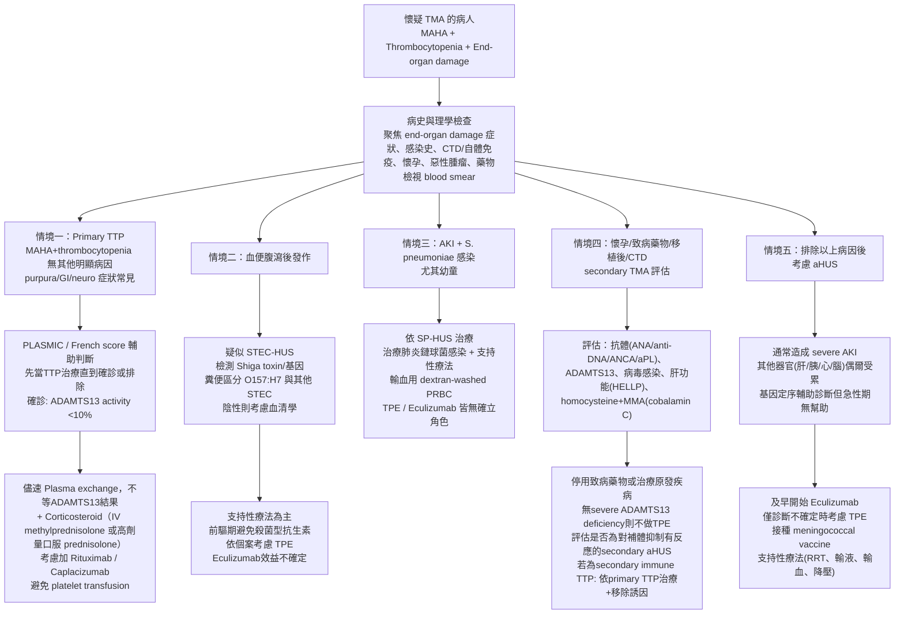

# Thrombotic Microangiopathy (TMA) 重點整理

> 資料來源：DynaMed - Thrombotic Microangiopathy (TMA) - Approach to the Patient（Updated 2025/12/31）

---

## 一、定義與概論

**TMA** 是一組疾病的統稱，共同特徵為：

- Microangiopathic hemolytic anemia (MAHA)：low haptoglobin、elevated LDH、elevated reticulocytes，peripheral smear 可見 schistocytes
- Thrombocytopenia
- 微血管血栓形成導致 end-organ damage

TMA 同時是一個**臨床症候群**與**病理診斷**：

- 臨床：MAHA + thrombocytopenia + organ injury
- 病理：occlusive thrombus（fibrin/platelet-rich）影響小血管，伴隨內皮與血管壁異常

有些病人只有腎臟受影響（腎切片顯示 TMA），但周邊血液沒有明顯溶血或血小板低下，稱為 **renal TMA (kidney-limited TMA)**。

### 何時懷疑 TMA

當病人出現以下三項時應懷疑 TMA 診斷：

- **MAHA**（microangiopathic hemolytic anemia）：peripheral smear 上可見 **schistocytes**
- **Thrombocytopenia**
- **End-organ damage**：由 microvascular thrombus formation 造成

---

## 二、分類

### Primary TMA

1. **TTP (Thrombotic Thrombocytopenic Purpura)**：定義為 TMA + severe ADAMTS13 deficiency (<10%)
   - Congenital TTP (Upshaw-Schulman syndrome)：AD 遺傳，佔所有 TTP <5%
   - Immune (acquired) TTP：anti-ADAMTS13 autoantibody，佔大多數
     - Primary：無 underlying disorder
     - Secondary：有 underlying disorder
2. **Atypical HUS (aHUS，也稱 complement-mediated HUS)**：alternative complement pathway 失調活化

### Secondary TMA（約佔所有 TMA 的 55%，排除 STEC-HUS 後）

與 pregnancy/postpartum、malignancy、transplant、infection、drugs 等相關，可能表現得像 TTP 或 aHUS，但不完全符合診斷標準。

### 其他重要分類（非 primary/secondary 二分法之外）

- **STEC-HUS**（Shiga toxin-related HUS）：primary HUS 型態，感染相關
- **SP-HUS**（S. pneumoniae-HUS）

### 比利時 336 位病人的病因分佈（2009–2019）

| 病因 | 比例 |
|------|------|
| Secondary TMA | 56% |
| STEC-HUS | 21% |
| aHUS | 15% |
| TTP | 9% |

Secondary TMA 中最常見：HSCT (30%)、solid-organ transplant (23%)、malignant hypertension (13%)、drugs (11%)、malignancy (6%)、pregnancy (4%)、infection (4%)、glomerular disease (4%，含 ANCA vasculitis、IgA nephropathy)、systemic disease (3%，含 SLE、SSc renal crisis、APS)、cobalamin C deficiency (1%)。

---

## 三、風濕免疫相關的 TMA（考試重點）

### SLE-associated TMA

- TMA 見於 3–9% 的 SLE 病人；lupus nephritis 病人中 1–24% 併發 TMA
- 各 class 的 lupus nephritis 都可能併發 TMA，但**以 class IV 最常見**
- 致病機轉：
  - Anti-ADAMTS13 autoantibody → immune TTP
  - Classical + alternative complement pathway 活化
  - Anti-phospholipid or cryoglobulin 抗體造成免疫複合體介導的血管損傷
- 誘發因子：lupus flare、infection、pregnancy、藥物不遵從
- Lupus nephritis + TMA 病人中，約 80% TMA 只侷限於腎臟；1–13% 同時有 APS

### APS / Catastrophic APS (CAPS)

- APS 病人偶爾表現 TMA-like 特徵（microvascular thrombosis, thrombocytopenia, MAHA）
- 可表現為 APS nephropathy（aPL-associated nephropathy），少數為 CAPS
- 致病機轉：aPL 抗體經由 C5 cleavage 活化補體、活化 AKT/mTORC pathway 導致 fibrous intimal hyperplasia，並使內皮細胞呈現 procoagulant phenotype
- **CAPS 病人的補體基因突變率高達 60%**（一般 APS 只有 21.8%）
- TMA 特徵出現在 CAPS 首次發作時，日後**復發風險較高**

### Scleroderma Renal Crisis (SRC)

- 是一種 rheumatologic emergency
- 5–15% 的 diffuse cutaneous SSc、1–2% 的 limited cutaneous SSc 會發生 SRC
- 好發：diffuse SSc 發病 <4 年內（皮膚快速增厚期）；limited SSc 則較晚發生
- 危險因子：病程短、近期使用 corticosteroid、diffuse skin involvement、快速進展的皮膚病變、high skin score、大關節攣縮、tendon friction rub
- 表現：renal insufficiency (100%)、高血壓 (88%)、hypertensive encephalopathy (58%)、TMA (56%)
- **治療首選：ACE inhibitor**（住院病人建議用短效如 captopril，因血壓反應難預測）；若最大劑量仍控制不佳可加 ARB、CCB、doxazocin、clonidine、alpha-blocker、IV iloprost；**避免 beta-blocker**（會加重血管收縮、降低心輸出量、惡化 Raynaud's）

### Vasculitis-associated（kidney-limited TMA 常見於）

ANCA-associated vasculitis (MPA, GPA)、adult-onset Henoch-Schönlein purpura，以及 RA、Adult-onset Still disease、dermatomyositis 也可見 renal TMA。

---

## 四、其他 Secondary TMA 病因

- **Malignant hypertension**：TMA 見於高達 50% 病人；為 hypertensive emergency 的 end-organ damage 表現之一
- **Infection**：HIV（TMA 可能是 HIV 的首發表現，40–50% ADAMTS13<10%）、HCV、CMV、EBV、HSV、influenza（H1N1 尤其）、COVID-19、結核、細菌/黴菌感染
- **Cancer-associated**：多為轉移性腺癌（胃、肺、乳、攝護腺），高達 90% 已有轉移；血液腫瘤（lymphoma、acute leukemia、MDS）
- **Transplant-associated**：HSCT（allogeneic 5–15%）、腎臟移植（de novo 或 recurrent）
- **Drug-induced**：佔所有 TMA 10–13%、secondary TMA 的 20–30%
  - **Quinine**：最常見藥物病因（約 90% 的 drug-induced TMA），免疫媒介
  - Calcineurin inhibitors (cyclosporine, tacrolimus)
  - Proteasome inhibitors (bortezomib, carfilzomib, ixazomib)
  - Thienopyridines (ticlopidine >> clopidogrel)
  - Gemcitabine、Mitomycin C
  - VEGF inhibitors/receptor blockers (bevacizumab, sunitinib, pazopanib)
  - Interferon、Platinum-based drugs、Emicizumab、Simvastatin、Trimethoprim
- **Pregnancy-associated**：preeclampsia、HELLP、TTP、aHUS（70–80% 發生在產後）
- **Pancreatitis-associated**：ADAMTS13 通常僅輕度下降
- **Cobalamin C deficiency**：MMACHC 基因缺陷，血漿 homocysteine 與 methylmalonic acid 上升，但 B12/folate 正常

---

## 五、致病機轉摘要

- TMA 的血栓主要由 **platelet** 組成（無明顯 coagulation cascade 活化）→ 所以 PT/aPTT 正常，這點可與 DIC 區分
- 但 **catastrophic APS 與 HELLP** 可見 fibrin-platelet thrombosis
- TTP：ADAMTS13 severe deficiency → ultra-large vWF multimer 無法被分解 → 過度血小板結合
- aHUS：alternative complement pathway 失控活化（40–60% 病人有補體調節基因異常）

---

## 六、臨床表現

- **TTP 經典 pentad**（thrombocytopenia + MAHA + neuro impairment + renal impairment + fever）**僅見於約 5% 病人**，不可作為診斷依據；只要有 MAHA+thrombocytopenia 就應啟動治療
- TTP：好發育齡女性（30–40歲），但任何年齡都可能；神經學症狀常見（up to 25% focal deficit），platelet 通常 <30×10⁹/L
- **aHUS 典型三徵**：MAHA + thrombocytopenia（通常輕度）+ AKI，但完整三徵不一定都出現（15–20% 血小板正常、6% 兒童無貧血、20% 腎功能保留）
- **STEC-HUS**：好發 <4 歲兒童，血便腹瀉後 4–7 天出現腎衰竭；neuro involvement ~40%
- **SP-HUS**：好發 <2 歲，肺炎鏈球菌感染後 3–13 天發生

---

## 七、診斷流程

### 一般原則

確診 TMA 後**最緊急的目標**是排除/確認 TTP（因治療時效性極高），用 **ADAMTS13 activity <10%** 確診。**不可因等待 ADAMTS13 結果而延遲治療。**

### 臨床預測分數（協助判斷 ADAMTS13 deficiency 可能性）

**PLASMIC score**（每項 1 分）：

- Platelet <30×10⁹/L
- Hemolysis (retic>2.5%, undetectable haptoglobin, indirect bili>2)
- 過去一年無 active cancer
- 無 solid-organ/HSCT 病史
- MCV <90 fL
- INR <1.5
- Creatinine <2 mg/dL

→ 0–4分低風險 (0–4%)；5分中風險 (5–24%)；6–7分高風險 (62–82%)

**French TTP score**：Cr ≤2.26 mg/dL + platelet ≤30×10⁹/L + ANA(+)，≥1項符合 → sensitivity 98.8%、NPV 93.3%，但 specificity 僅 48.1%

### ADAMTS13 activity 不同疾病比較（Br J Haematol 2015）

| 疾病 | Median ADAMTS13 |
|------|------------------|
| TTP | 5%（0–11%）|
| aHUS | 66.5% |
| HUS | 56% |
| Secondary TMA | 65% |

### aHUS 診斷

**無特異性檢驗，靠排除診斷**（排除 TTP、STEC-HUS、SP-HUS、其他明確病因的 TMA）。輔助檢查：anti-CFH autoantibody、基因檢測（C3, CFB, MCP/CD46, CFI, CFH, THBD, DGKE, PLG）、modified Ham assay（功能性補體活化檢測）。

> **臨床要點**：補體檢測（除功能性 cell-based assay 外）對急性期處理幫助不大——補體 level 對診斷無幫助，基因定序雖可確診但要等數週（來不及做臨床決策），且約一半病人測不到已知突變。

### Autoimmune/CTD screen（風濕科重點）

ANA/dsDNA、RF、ENA、ANCA、anti-GBM、aPL (cardiolipin, β2-GPI, lupus anticoagulant)

---

## 八、治療（依病因分類）

### Immune TTP

- **Therapeutic plasma exchange (TPE)**：懷疑診斷即應盡快開始（勿等 ADAMTS13 結果）
- 早期考慮 **caplacizumab**
- Corticosteroid ± rituximab
- 避免 platelet transfusion（除非有致命出血）

### Congenital TTP

- Plasma infusion 或 intermediate purity Factor VIII（含 ADAMTS13）
- **Recombinant ADAMTS13** 現為首選（prophylactic 或 on-demand）

### aHUS / CM-HUS

- **Eculizumab 或 ravulizumab 為首選（first-line）**
- TPE 僅在診斷不確定（成人常見）或無法取得 eculizumab 時作為 first-line
- 若偵測到 anti-CFH autoantibody：TPE 可能改善血液學/腎功能，並考慮加上 eculizumab ± rituximab/cyclophosphamide

### STEC-HUS

- 支持性療法為主（輸液電解質、輸血、腎替代治療）
- **前驅腹瀉期避免使用抗生素**（會增加 HUS 風險）
- <18歲避免止瀉藥(loperamide)及NSAID
- Eculizumab 證據不足，僅嚴重神經學表現時考慮

### SP-HUS

- Penicillin 類抗生素治療肺炎鏈球菌感染
- 輸血前需 **dextran-washed RBC**（移除anti-T抗原抗體）
- 避免血漿製品；**TPE 與 eculizumab 都沒有明確角色**

### SLE/APS-associated TMA（風濕科重點）

- 證據等級低（case reports/expert opinion為主）
- 治療依病因調整：drug-induced→停藥；immune-mediated→TPE+免疫抑制；aHUS-like→anti-complement therapy
- **KDIGO glomerulonephritis guideline**：
  - Lupus + TTP → TPE + glucocorticoid + rituximab ± caplacizumab
  - Lupus + APS (腎侵犯) → anticoagulation ± TPE
- Eculizumab 可用於難治型 SLE/APS TMA

### Catastrophic APS (McMaster RARE guideline)

- **組合治療**：glucocorticoid + heparin + (IVIG 或 TPE)，優於單一藥物（Conditional, very low evidence）
- Therapeutic-dose anticoagulation（unfractionated heparin 為主，Strong recommendation）
- 可加 antiplatelet agent
- **避免 rituximab**（Conditional），但難治型或血小板低下時仍可考慮

### Scleroderma Renal Crisis

見上方「三、風濕免疫相關的 TMA」

### Cancer-associated TMA

- 支持性療法 + 治療原發癌症
- **BSH 不建議用 TPE**（Grade 1C）

### Transplant-associated TMA

- HSCT：移除誘發因子（calcineurin inhibitor/sirolimus）、支持性治療
- **BSH 不建議 TPE**（Grade 1C）
- **Narsoplimab (Yartemlea)** 為新核准（2025/12 FDA）之 lectin pathway inhibitor，用於 HSCT-TMA
- Eculizumab 在小型研究顯示效果（1年存活率62%，高風險族群）
- 腎臟移植：移除致病藥物（換成 mTOR inhibitor）、TPE、eculizumab；**復發性 aHUS 應立即開始 eculizumab**

### Drug-induced TMA

- 停藥為主要治療
- Ticlopidine-induced (ASFA Category I) 建議 TPE；Clopidogrel/Gemcitabine/quinine-induced 則證據等級較低

### Pregnancy-associated TMA

- Preeclampsia/HELLP：definitive treatment 是**生產**
- TTP：初期以 TPE+corticosteroid 治療（同 immune TTP）
- aHUS：Eculizumab 在懷孕中證實安全（PNH cohort study，母親存活率100%、胎兒存活率96%）

### Cobalamin C deficiency-associated HUS

- Hydroxocobalamin 1mg/day IM/SC + Betaine 250mg/kg/day PO + Folic acid 1mg/day PO

---

## 九、ASFA (American Society for Apheresis) TPE 建議摘要

| 病因 | Category/Grade |
|------|-----------------|
| Scleroderma-associated TMA | Category III, 2C |
| Transplant-associated TMA | Category III, 2C |
| STEC-HUS | Category III, 2C |
| SP-HUS | Category III, 2C |
| TMA未於產後24-72hr改善或懷疑TTP | Category III, 2C |
| TMA妊娠<28週或severe preeclampsia | Category III, 2C |
| Ticlopidine-induced | Category I, 2B |
| Clopidogrel-induced | Category III, 2B |
| Gemcitabine/quinine-induced | Category VI, 2C |
| Malignant hypertension、cancer-associated、cobalamin-C deficiency、pancreatitis-associated | 未特別提及 |

---

## 十、與其他疾病的鑑別（Mimics）

- Pseudo-TMA (vitamin B12 deficiency)
- Heparin-induced thrombocytopenia (HIT)
- Autoimmune hemolysis/Evans syndrome
- **DIC**：也可有MAHA+thrombocytopenia，但**凝血功能（PT/aPTT）異常且會活化 coagulation/fibrinolysis**，這點與TMA不同（TMA的PT/aPTT正常）；少數情況DIC與TMA可同時並存（如骨轉移之胃癌）
- 腎切片上易混淆的疾病：immune-mediated GN（cryoglobulinemic GN、crystalglobulinemia）、ANCA-associated GN（focal necrotizing lesion 似血栓）、脂質代謝疾病（LCAT deficiency 等，double contour似TMA的MPGN pattern）

---

## 十一、Flow Chart：TMA 診斷處置流程

---

## 參考文獻

- DynaMed. Thrombotic Microangiopathy (TMA) - Approach to the Patient. Updated 2025 Dec 31.
- Scully M, Rayment R, Clark A, et al.; BSH Committee. A British Society for Haematology Guideline: Diagnosis and management of thrombotic thrombocytopenic purpura and thrombotic microangiopathies. Br J Haematol 2023 Nov;203(4):546-563.
- Scully M, Cataland S, Coppo P, et al. Consensus on the standardization of terminology in thrombotic thrombocytopenic purpura and related thrombotic microangiopathies. J Thromb Haemost. 2017 Feb;15(2):312-322.
- McMaster RARE-Bestpractices clinical practice guideline on diagnosis and management of the catastrophic antiphospholipid syndrome. J Thromb Haemost 2018 Aug;16(8):1656.
- KDIGO 2021 Clinical Practice Guideline for the Management of Glomerular Diseases.
- Review of TMA in systemic lupus erythematosus and antiphospholipid syndrome. Semin Arthritis Rheum 2019 Aug;49(1):74.
