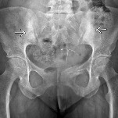
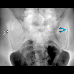
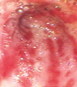

# 2026 風濕科專科考試 筆試 & 口試

> 本檔案為考生集體回憶整理之考古題，內容未經官方核對，部分選項或答案為考生記憶所及，可能有誤或不完整，使用時請自行查證。口試部分尚未整理，待補充。

## 筆試

### 1. T cell-B cell 之間的 signal
考點：BAFF、CD40/CD40L、Fcγ receptor 抑制角色、Abatacept 機轉

---

### 2. SLE 的 type 1 interferon signal 從哪個細胞來？

---

### 3. Complement 的生理意義

---

### 4. SLE 相關 innate immune system
考點：cGAS-STING、TLR7/9、NETosis、JAK1/TYK2…

---

### 5. PreRA 的 pathophysiology
考點：抽菸、HLA、Gut microbiota 跟 seropositive 關係、口腔 Porphyromonas gingivalis

---

### 6. ACR 推薦使用何種方法作為 ANA 首選測試？
- A Immunoline assay
- B HEp-2 IIF
- C ELISA
- D Multiplex immune tests

---

### 7. ANA titer 與臨床監測的關係，何者適當？
- A Titer 變化是 SLE 疾病活性的有效指標
- B High titer (>1:640) 必有系統性自體免疫疾病
- C 治療如果有效，ANA 應轉陰性
- D 一旦確定診斷，不需要頻繁追蹤監測 ANA

---

### 8. 何種 ANA pattern 與 limited systemic sclerosis 相關？
- A AC-19
- B AC-1
- C AC-3
- D AC-29

---

### 9. Biomarker level 與疾病活性的關係，何者不相關？
- A 血中 C3, C4 和 lupus nephritis
- B 血中 KL-6 和 SSc-ILD
- C 血中 ferritin 和 AOSD
- D 血中 calprotectin 和 IBD

---

### 10. 急性單關節炎，最關鍵的資訊為何？
- A Synovial fluid analysis
- B Synovial fluid ANA
- C Serum uric acid alone
- D Plain x-ray

---

### 11. 38 歲女性，多關節疼痛兩個月
一開始雙手腕、右邊 3, 4 MCP、左邊 2, 3 MCP，第二個月變成雙側手肘、雙肩、右膝疼痛，到門診當天右手腕、雙肩疼痛，看到雙側第三 MCP 腫脹。根據 2010 RA criteria，在關節項目可以得幾分？
- A 1
- B 2
- C 3
- D 5

---

### 12. 承上題
RF 40（正常值 15），Anti-CCP 陰性，ESR 2，CRP < 0.02 mg/dL，ANA 1:640 陽性，何者正確？
- A 符合 2010 RA criteria，可以確診 RA
- B 符合 2010 RA criteria，但 ANA 陽性，應考慮其他自體免疫疾病
- C 不符合 2010 RA criteria，應考慮其他自體免疫疾病
- D 不符合 2010 RA criteria，應考慮其他非自體免疫疾病的原因，如藥物或姿勢不良引起

---

### 13. 55 歲類風溼關節炎的病人來診間，MCP 的 PE 臨床實用性何者正確？
- A 傳統 2 指檢查 MCP 關節的 sensitivity 大於 4 指檢查
- B 定量性，用 S-T-L record
- C 4 指檢查用雙側食指及拇指檢查，同時用優勢手支撐
- D Squeezing test 檢查其他關節病變，不是為了檢查滑膜炎

---

### 14. 早期關節炎的抗體，何者正確？
- A RF > 90% sensitivity 及 specificity
- B ACPA sensitivity 約等於 RF，但 specificity 較佳
- C ELISA ANA 陽性在多關節炎的病人可診斷 SLE
- D 為了經濟及成本考量，不應同時檢測 RF、ACPA

---

### 15. 45 歲女性，對稱性的近端無力，與臉部特徵性紅疹，上眼瞼紫紅色水腫紅斑
下列何者出現代表系統性疾病？
- A 對稱性紫紅色紅斑或丘疹在 PIP、MCP 關節背側
- B 下肢 palpable purpura，切片為 leukocytoclastic vasculitis
- C 膝關節有 border 清晰、紅斑性鱗屑
- D Diffuse 色素沉澱，延伸至 MCP 近端

---

### 16. 55 歲女性因 RA 追蹤，手部超音波檢查
MCP joint 背側縱向切面中，發現顯著 synovial hypertrophy，超過關節連線且頂端成圓頂狀突出。Joint 內有明顯 PD 點狀血流訊號，其型態不隨關節位置而消失，血流區域佔滑膜總面積 30%。依照 EULAR-OMERACT GS & PD grading system，此為？
- A Grade 0
- B Grade 1
- C Grade 2
- D Grade 3

---

### 17. 65 歲男性，left thumb base pain & swelling after sprain injury for 10 days，ESR & CRP elevation（題幹附影像）
Diagnosis?
- A Rheumatoid arthritis
- B Gouty arthritis
- C Septic arthritis
- D Osteoarthritis

---

### 18. 68 歲男性，left hip pain for days（題幹附影像）
The most likely diagnosis should be?
- A Left pelvic bone fracture
- B Left pelvic bone Paget's disease
- C Left pelvic bone metastasis
- D Left pelvic bone osteomyelitis

---

### 19. 29 歲男性，Skin: psoriasis vulgaris（題幹附影像）
What radiographic abnormality is incorrect?
- A Acrolysis at right thumb tuft
- B Acrolysis at left thumb tuft
- C Enthesopathy at base of the distal phalanx of left index finger
- D Enthesopathy at base of the distal phalanx of right index finger

---

### 20. 下列關於 RA 及 seronegative SpA 的影像學比較，SpA 較常發生的是？
- A Osteoporosis
- B Subcutaneous nodule
- C Articular pannus formation
- D Enthesitis

---

### 21. Conventional DMARDs 選正確的
- A SSZ 在腸胃道不容易吸收，會分解成 5-ASA、sulfapyridine 增加腸胃道抗發炎效果
- B Mercaptopurine 是 AZA prodrug
- C Leflunomide 是抑制 purine
- D 除 MTX 外，其他藥物很少肝毒性

---

### 22. SLE 使用類固醇
1. 氟化類固醇（Dexamethasone）能穿過胎盤（不易被胎盤的 11β-HSD2 代謝、逃過此酵素的滅活作用，才能大量通過胎盤到達胎兒）
2. 哺乳如果用 prednisolone ≥ 20 mg/day，服藥後 4 小時內避免哺乳/擠出丟棄，並非完全不能用類固醇

---

### 23. AZA 不能跟什麼併用？
- A Cefalosporin
- B Allopurinol
- C Calcium channel blocker
- D Amphotericin B

---

### 24. RA，DAS28 有 5.6 分，HBsAg(-)，anti-HBs(+)，anti-HBc(+)，目前用 MTX + SSZ，如果要用生物製劑，何者正確？
- A Rituximab 要跟抗 B 肝病毒藥併用
- B Anti-IL6、TNFα HBV flare risk 較低
- C HBsAg(+) 才要預防性投藥
- D JAK inhibitor HBV flare risk > rituximab

---

### 25. 45 歲女性，新診斷 RA，CCP 50 幾，mild joint erosion at MCP 2-3，underlying 有控制良好的 HTN、DM
根據現行 guideline，要如何治療？
- A HCQ 先給三個月，避免直接給 MTX 因其藥物毒性
- B 立即 MTX + low dose prednisolone (7.5mg/day) 緩解病人症狀
- C DAS28 高分，要直接跳過 conventional DMARDs，直接給生物製劑
- D 直接三合一治療 (MTX + SSZ + HCQ) 優於一開始只用 MTX

---

### 26. 38 歲女性確診 RA 6 個月，MTX 從 10mg/week 開始後增加到 15mg/week，加上補充葉酸，經 8 週後 AST、ALT 增加 5 倍，下列處置最合適？
- A 立即停用 MTX，改成 leflunomide
- B 暫停 MTX，等肝指數恢復正常後重新評估是否從低劑量重新開始，並且增加葉酸劑量
- C 屬常見副作用，無需停藥，增加葉酸補充即可
- D 進行肝切片，確認是否跟 MTX 有關

---

### 27. MTX + SSZ + HCQ 與 ETN + MTX 比較
結論：三合一不劣於 ETN + MTX，兩組互換率 27%，且換後額外改善

---

### 28. 關於 ReA，那一項是正確？
- A 90% 的病人會發展成慢性關節炎導致關節變形，因此一旦確診後應積極使用 3 種 DMARDs 治療
- B 腸道菌感染一定要使用抗生素 2 個禮拜
- C 披衣菌感染應使用 doxycycline & rifampin 治療六個月
- D Keratoderma blenorrhagicum & circinate balanitis 需用抗黴菌藥膏，若使用外用類固醇會造成皮膚症狀更嚴重

---

### 29. 關於 PsA，那一項是正確？
- A 發病以青少年最多，男女發生率 3:1
- B 對 anti-IL6 antibody 有效
- C Skin lesion & arthritis 同時發生佔大多數
- D DIP subtype 最易有指甲侵犯

---

### 30. ASAS peripheral SpA 分類的進入條件
- A IBD 至少三個月
- B 發病 < 45 歲
- C 具周邊關節表現：arthritis, enthesitis, dactylitis
- D 必須具備放射學上的髖關節炎

---

### 31. HLA-B27 與 reactive arthritis 的關係何者正確？
- A 與疾病慢性化和急性期的嚴重度相關
- B 是診斷的必要條件
- C HLA-B27 與疾病的關聯只在腸道感染中存在
- D HLA-B27 陽性者感染後一定會發病

**考生回憶答案：A**

---

### 32. 關於 ANA 陰性的 SLE 患者，下列何者錯誤？
- A 遺傳性 C2/C4 deficiency 的 SLE 患者，ANA 常呈現陰性或弱陽性
- B Anti-Ro60 存在於細胞質內，故單獨存在此抗體的 SLE 患者 ANA 常呈現陰性
- C Anti-RibP 存在於細胞質內，故單獨存在此抗體的 SLE 患者 ANA 常呈現陰性
- D Prozone：前帶現象/抗體濃度過高

**考生回憶答案：B**（Ro60 在核內，Ro52 才在核外；早期會偽陰性是因為傳統 ANA 檢測受質（如鼠肝細胞）在固定處理過程中，Ro 抗原非常容易被洗掉流失）

---

### 33. 關於 Hydroxychloroquine (HCQ) 於 SLE 患者使用的實證，下列何者有誤？
- A 根據 ACR/EULAR 指引，建議所有 SLE 患者（包含兒童與成人）都應常規使用 HCQ 作為第一線的基礎治療，除非患者有使用禁忌症，每日劑量應 ≤ 5mg/kg
- B 具有多重益處，包含能降低疾病復發（flare）、減少血栓與心血管疾病風險、預防器官損傷，並提高整體存活率
- C 因其視網膜毒性（retinal toxicity）風險，使用滿五年後，建議至眼科進行檢查，項目包含眼底檢查、視野檢查與 Spectral-domain optical coherence tomography (SD-OCT)
- D HCQ 相關 retinopathy 的主要風險因子包含腎功能不全、高劑量、以及長時間使用（五年以上）

**考生註記（記憶不確定）**：這題時間太趕，選項細節記得不太確定，可能是考 A（病情需要如懷孕時允許短期使用較高的劑量 5–6.5 mg/kg/天）或 C（在開始用藥時就要進行一次 baseline 檢查）。

---

### 34. 41 歲女性，近期發燒、倦怠、臉部及全身紅疹
實驗室檢查呈現 pancytopenia，C3 與 C4 下降，anti-dsDNA 顯著升高，creatinine 0.9 mg/dL，urine analysis 呈現 urine protein 1+。下列何者錯誤？
- A 符合 SLE classification criteria，但仍需要排除其他鑑別診斷如血液腫瘤疾病等
- B 若後續檢查後確診為 SLE，應開始評估全身器官侵犯之狀況，並可利用 SLEDAI-2K、SLE-DAS、BILAG 等工具評估疾病活性
- C 因患者 creatinine 位於正常值，此時不需做後續腎臟相關評估如 24-hour urine protein 或腎臟切片，但仍需密切抽血追蹤腎功能
- D 若追蹤時顯示 SLEDAI-2K 後續有上升 6 分以上，可以考慮調整藥物使用，例如加入 immunosuppressants 或 bDMARDs 等

**考生回憶答案：C**

---

### 35. 關於 SLE 與 APS 敘述何者錯誤？
- A 抗磷脂症候群典型有血栓、反覆性流產、血小板上升的表現
- B 在藥物相關的 SLE 患者，常可檢測到 anti-histone Ab
- C （選項記錄不完整）
- D （考生來不及抄，抱歉）

**考生回憶答案：A**（criteria 中應是血小板「下降」）

---

### 36. 與狼瘡中樞神經侵犯相關的抗體為何？
**答案：Anti-ribosomal P**

---

### 37. 硬皮症當中，與癌症相關的抗體為何？
**答案：Anti-RNA polymerase III**

---

### 38. 考 SSc 相關的檢查何者錯誤？
（考生僅記得其中一個選項，且應為錯誤選項）主要講述 Raynaud's phenomenon 的甲摺鏡檢查，與大血管的變異有好的關聯（應為關聯性沒有很大，此為錯誤敘述）

---

### 39. 關於 SSc-ILD 的描述何者正確？
（考生僅記得兩個選項）
- 最常見的 pattern 為 UIP（錯誤，最常見是 NSIP）
- 最常侵犯的範圍為 anterior and basilar lobes（應為正確選項）

---

### 40. 關於 SSc 相關敘述何者錯誤？
錯誤的選項為：Th1/Th2 imbalance 並傾向 Th1 predominance（正確應為 Th2 predominance）

---

### 41. 關於 Systemic sclerosis，下列何者錯誤？
- A CCB 是一種治療藥物
- B TTE 測得 TRPG > 40 mmHg，即為 PAH
- C ACEI 治療 SRC，若病情惡化應停止 ACEI
- D ACEI 不建議用於預防 SRC

---

### 42. 52 歲男性，長期使用 atorvastatin 40 mg QD，持續三年
近日出現急性近端肢體無力，CK 上升至 15,000 U/L，停藥後肌無力持續三個月仍未改善。肌肉切片可見明顯肌纖維壞死，但發炎細胞浸潤極少。相關抗體為何？
- A Anti-Jo-1
- B Anti-Mi-2
- C Anti-SRP
- D Anti-HMGCR

---

### 43. 45 歲女性，為工廠作業員，長期暴露於粉塵及化學氣體，後診斷為肌炎，anti-Jo-1 positive，合併 ILD
下列何者正確？
- A UV exposure 是 anti-Jo-1 myositis 最主要的環境危險因子
- B 吸入性環境暴露是已知危險因子；anti-Jo-1 患者的 ILD 發生率高，提示肺部可能是啟動免疫反應的部位
- C Statin 使用會增加 anti-Jo-1 antibody 的產生
- D HLA 與環境暴露之間沒有交互作用

---

### 44. 55 歲女性，三個月來出現近端肌肉無力及上樓梯困難，手指關節伸側有紫紅色丘疹（Gottron's papules），CK 升高，anti-Mi-2 陽性
下列何者正確？
- A 有較高風險發生 rapidly progressive ILD
- B 惡性腫瘤機率顯著高於 anti-TIF1-γ 陽性者
- C 對皮質類固醇反應良好，預後較佳
- D 肌肉病理為 endomysial CD8+ T-cell infiltration

---

### 45. 關於 inclusion body myositis (IBM)，下列何者錯誤？
- A 症狀非對稱，影響近端和遠端肌肉
- B 對高劑量 steroid 有良好反應
- C 病理切片可見 rimmed vacuoles
- D 約三分之一患者可檢測到 anti-cytosolic 5'-nucleotidase 1A (cN1A) antibody

---

### 46. 心血管疾病是肌炎患者死亡的一個重要風險因子，以下何者錯誤？
- A 肌炎患者的心臟侵犯在疾病發生初期即在臨床上顯而易見
- B 最常見的心臟侵犯是 EKG 發現的傳導異常和心律不整
- C TnI 比 TnC 或 TnT 更能預測心臟侵犯
- D 即使病人已緩解 (remission)，仍可能在心臟 MRI 看到 cardiomyopathy

---

### 47. Myositis 的鑑別診斷很多，下列哪一個是 metabolic myopathy？
- A Limb-girdle muscular dystrophy
- B Dysferlinopathy (Miyoshi myopathy & LGMD2B)
- C Mitochondrial myopathies
- D Cushing's syndrome

---

### 48. 關於 SjD 的治療描述，下列何者適當？
- A JOQUER trial 發現 HCQ 可以減少血中 IgG、IgM，有效降低疾病活性
- B Belimumab 針對 BAFF/BLyS，目前已經取得 FDA 核可
- C Ianalumab 針對 BAFFR，已經獲得美國突破性治療認定
- D Rituximab 治療 SjD 24 週的 trial，效果顯著並且已經獲得 FDA 核可

---

### 49. 林先生是一位 45 歲男性，最近三個月發燒、夜間盜汗，同時體重下降 5 公斤，多處無痛性淋巴結腫大
抽血發現 CRP 12 mg/dL, ESR 85, IgG 3500, IgG4 520，接受淋巴結切片檢查，病理報告顯示 increased plasma cell with IgG4/IgG 55%，並沒有看到 storiform fibrosis or obliterative phlebitis。請問以下敘述何者正確？
- A 因為血液及組織切片皆顯示 IgG4 比例高，符合 IgG4 的病理閾值，優先考慮診斷為 IgG4RD，發燒及 CRP 高皆為晚期表現
- B 此病人臨床表現及病理結果皆暗示 iMCD，要檢測 IL-6、HHV8 以幫助鑑別診斷
- C 只要淋巴結切片檢查顯示其中 plasma cell IgG4/IgG > 40%，根據 2019 ACR/EULAR IgG4RD classification criteria，已具特異性排除 Castleman disease
- D IgG4RD 淋巴結切片必定會有 storiform fibrosis 和 obliterative phlebitis，這個病人並沒有這樣的表現，因此完全排除 IgG4 相關的任何病理機制

---

### 50. 52 歲女性已經診斷 SjD 多年，近期出現漸進性的呼吸喘，HRCT 發現雙側肺部瀰漫性 thin-wall cysts 和毛玻璃狀變化 (GGO)，切片顯示為 LIP
下列何者正確？
- A LIP 高度惡性傾向
- B 僅需給 HCQ 治療，每三個月追蹤影像
- C 可以考慮給予口服類固醇
- D 多見於 30-40 歲男性 SjD 患者

---

### 51. 咳血病人，ANCA 陽性，無上呼吸道進犯，CT 發現有 ILD，最可能的診斷為何？
- A PAN
- B GPA
- C EGPA
- D MPA

---

### 52. 尿液檢查有紅血球和白血球，ANCA/anti-GBM 皆陽性
考點：AAV 和 Goodpasture 可同時存在

---

### 53. 單腳內側足踝疼痛病人，腫痛數週，自己服用藥物可以完全消退，沒有任何過去病史，尿酸 5.1，Cr 0.8，RF/CCP 陰性
請問最可能的鑑別診斷為何？
- A 退化性關節炎
- B 痛風
- C 假性痛風
- D 類風濕性關節炎

---

### 54. 以下哪一個藥物不會增加血中尿酸值？
- A Captopril
- B Low-dose aspirin
- C CsA
- D Pyrazinamide

---

### 55. Allopurinol 300mg/day 使用了三年無過敏，痛風控制得宜，有尿路結石病史，病人突然想要檢測 HLA-B5801，發現是陽性，為下一步怎麼做？
- A 繼續 Allopurinol
- B 停 Allopurinol 換 Benzbromarone
- C 換 rasburicase
- D 再檢測一次 HLA-B5801，上一次可能是偽陽性

---

### 56. 影像題：Crown dens syndrome
圖片出處：N Engl J Med 2012;367:e34（原文附圖，請參照原始出處）

---

### 57. 一位年長女性右肩急性疼痛，去年有外傷病史，近一年右肩常痠痛、上舉困難，沒有發燒、右肩腫脹、活動受限
X 光顯示關節狹窄與退化、旋轉肌袖 (rotator cuff) 與二頭肌的肌腱鈣化。超音波抽 12cc 關節液：translucent with blood streaks, poor viscosity, WBC 2500/HPF, no MSU or CPPD crystal, Gram stain negative。下列診斷關節炎的步驟何者最適合？
- A Synovial fluid acid fast stain
- B Arthroscopy with synovial biopsy
- C 關節液細菌培養
- D Alizarin red stain

---

### 58. 一位中年男性，反覆雙下肢膝、踝關節痛數個月，每次發作約兩週會緩解，抽血檢查 UA 5.1 mg/dL，身上沒有皮疹，沒有家族病史，除此之外沒有其他不舒服
請問最可能的診斷是什麼？
- A 乾癬性關節炎
- B 僵直性脊椎炎
- C 痛風
- D 類風溼性關節炎

---

### 59. 關於 Bone marker 敘述何者正確？
- A PINP 是 bone resorption marker
- B CTX 是 bone formation marker
- C BTM 可以用來診斷 osteoporosis
- D BTM 可以用來監測 osteoporosis 治療反應/compliance

---

### 60. 考 Secondary osteoporosis 的鑑別診斷，需要做哪些檢查
（考生僅記錄題幹，選項未記錄）

---

### 61. RA 造成 osteoclast 活化機轉
**答案：RANKL**

---

### 62. 64 歲類風濕性關節炎患者長期接受糖皮質類固醇治療
依全民健康保險藥品給付規定，糖皮質類固醇使用達下列何種劑量並持續超過 3 個月，可視為骨質疏鬆性骨折的高風險因子？
- A > 1.5 mg/day
- B > 2.5 mg/day
- C > 5 mg/day
- D > 7.5 mg/day

> 註：原始題庫中此題選項與第 63 題（denosumab）標在同一段，考生轉錄時可能將兩題混在一起，選項歸屬僅供參考，日後查證時請留意。

---

### 63. RA 合併骨鬆，哪一個藥物是健保核准用於 RA 合併骨鬆且不需脆性骨折？
其他選項有 teriparatide、romosozumab 等

**考生回憶答案：Denosumab (Prolia)**

---

### 64. 54 歲女性，有長期骨痛，合併疲倦及身高變矮，手部 X 光顯示 middle phalanx radial aspect 有 subperiosteal bone resorption
下列何者為最有可能的診斷？
- A Primary hyperparathyroidism
- B Rheumatoid arthritis
- C Multiple myeloma
- D Paget's disease of bone

---

### 65. 情境題：一長串描述 VEXAS 的典型臨床症狀
68 歲男性，relapsing polychondritis、macrocytic anemia、bone marrow 有 vacuoles。其他選項也是跟 autoinflammatory disease 有關。

**考生回憶答案：UBA1**

---

### 66. 年輕病患若出現 nontraumatic osteonecrosis，下列何者無關？
- A Sickle cell anemia
- B Chronic hepatitis C infection
- C Alcohol
- D Antiphospholipid syndrome

---

### 67. 35 歲男性，已知罹患 HIV，近期有發燒、疲勞、紫斑，CD4 計數 350 cells/mm3，懷疑血管炎
以下何者正確？
- A 考慮感染，必要時應切片、培養，以排除感染
- B 腦部血管炎依 MRI 即可診斷，不須病理確認
- C 一旦懷疑可依 ANA 結果開始免疫抑制治療，不須進一步檢查
- D HIV 相關血管炎對類固醇治療通常無效

---

### 68. 風濕免疫相關疾病的患者得到 COVID-19 時，用藥何者不正確？
- A MTX 不會增加 COVID-19 嚴重度，但會影響疫苗效力
- B 免疫抑制劑中，B 細胞耗竭療法（如 Rituximab）在研究中已被證實對 COVID-19 重症或死亡風險增加的關聯一致
- C Sulfasalazine 不會增加 COVID-19 嚴重度
- D HCQ 雖然在初期被看好療效，但研究被證實治療 COVID-19 無效

---

### 69. MIS-A 如何與急性 COVID-19 重症做出區分？
- A MIS-A 發生在感染後 2-6 週，且常併發新的心血管症狀
- B MIS-A 主要在 65 歲以上且嚴重呼吸衰竭
- C MIS-A 病毒的 PCR 有高病毒載量（低 Ct 值）
- D MIS-A 與長新冠（Long COVID）症狀完全重疊

---

### 70. 關於急性膝關節疼痛與活動受限，相關的身體檢查發現與其對應的疾病診斷，下列敘述何者最正確？
- A 執行關節觸診時，若在膝關節前側髕骨上方發現伴隨波動感的腫塊 (fluctuant mass)，且病患有反覆跪姿的病史，這對應到鵝足滑囊炎 (Pes anserinus bursitis)
- B 執行軸移測試 (Pivot-shift test) 時，將患者膝蓋完全伸直並使脛骨微內轉，同時施加外翻 (valgus) 壓力並緩慢彎曲膝蓋；若在彎曲 20 至 40 度時出現脛骨復位的「喀喀」聲 (clunk)，代表前十字韌帶 (ACL) 損傷
- C 執行半月板理學檢查時，若發現關節線壓痛並伴隨膝蓋反覆「卡住 (locking)」與「喀喀聲 (clicking)」，這明確對應到退化性關節炎 (Osteoarthritis) 的早期軟骨磨損
- D 檢查膝窩 (popliteal fossa) 時，若觸及飽滿的囊腫結構，這通常對應到前十字韌帶 (ACL) 黏液囊腫，在沒有關節炎的年輕病患中最為常見

---

### 71. 32 歲女性，帶嬰兒，radial styloid painful swelling，Finkelstein(+)，考哪條肌腱？
**答案：De Quervain's tenosynovitis > Abductor Pollicis Longus + Extensor Pollicis Brevis**

---

### 72. 23 歲男性，被診斷 Juvenile Spondyloarthritis，經過六年治療，ESR/CRP 都正常，但仍抱怨背痛
題目最後描述病人被診斷 FM 合併 18 個痛點，選正確？
- A 周邊發炎導致疼痛
- B HLA-B27 跟疼痛有關
- C 中樞疼痛處理異常
- D SIJ 破壞導致

---

### 73. 58 歲女性，多年前不孕時檢查過 SSA/SSB 陽性，生產過程順利，但最近出現蛋白尿、下肢水腫
Renal Bx 出現 Congo red stain(+)（考生表示中間還有一段沒記錄到），鑑別 Amyloidosis subtype

---

### 74. 48 歲男性，Hemochromatosis，HFE(+)，最常影響哪個關節跟 primary OA 最需鑑別診斷？
**答案：MCP2/3**

---

### 75. 下列哪個疾病的症狀最不常在 immune-related adverse events of checkpoint inhibitors for cancer therapy 發生？
- A Scleroderma
- B Myositis
- C Cutaneous vasculitis
- D Inflammatory arthritis

---

### 76. 下列哪個疾病的症狀最不常在 Rheumatic manifestations of neoplasia 發生？
- A Scleroderma
- B Eosinophilic fasciitis
- C Hypertrophic osteoarthropathy
- D Dactylitis

---

### 77. 60 歲女性因雙側腳踝持續疼痛腫脹 3 個月來到門診
身體檢查顯示雙側踝關節輕度腫脹、局部壓痛伴隨活動受限，抽血指數顯示 Uric acid: 7.5，其餘 ANA, RF, HLA-B27 皆陰性，雙腳踝 X-ray 顯示 cystic bone lesions with well-defined margins and lytic bone lesions with periosteal reaction，KUB 顯示 bilateral radiopaque nephrolithiasis and nephrocalcinosis，請問最有可能是以下哪個疾病？
- A Gouty arthritis
- B Non-radiographic spondyloarthritis
- C Rheumatoid arthritis
- D Sarcoid arthropathy

---

### 78. 62 歲女性因雙下肢漸進性水腫、嚴重疲憊及體重減輕 3 個月至門診就醫
身體檢查顯示雙側下肢呈凹陷性水腫，實驗室檢查顯示尿液分析中 24 小時尿蛋白高達 4.5 g、血清 Creatinine 1.8 mg/dL、Albumin 2.4 g/dL，隨後進行腎臟組織切片，經 Congo red 染色後於偏光顯微鏡下觀察到特異性的蘋果綠雙折射 (apple-green birefringence)，證實為澱粉樣變性 (Amyloidosis)，請問接下來該以下列何種方法進行 subtyping？
- A 再次進行腎臟切片之 Congo red 染色，並加做 Thioflavin T 螢光染色
- B 用雷射微解剖 (Laser microdissection, LMD) 精確純化病灶組織，再以質譜分析法 (Mass spectrometry, MS) 分析
- C 執行 Bone marrow biopsy 後，再觀察是否有 Multiple myeloma 的病灶
- D 利用 99mTc-PYP 或 99mTc-DPD 心臟骨骼掃描偵測

---

### 79. 55 歲男性，過去一年有慢性疲倦及持續肝功能異常，近期出現雙手第 2、3 MCP 關節疼痛
手部 X-ray 顯示 MCP 關節退化性變化，並可見典型 hook-like osteophytes。下列何項檢驗最適合進一步確認潛在疾病？
- A ANA、anti-dsDNA
- B RF、anti-CCP
- C Serum ferritin 與 transferrin saturation
- D HLA-B27

---

### 80. 72 歲男性，因 malignant melanoma 接受 ipilimumab + nivolumab 治療
第二次給藥後出現近端肢體無力，檢驗發現 CK、GPT、troponin-I 上升。下列處置何者最適當？
- A 繼續原 ICI 治療，加上 NSAID
- B 立即停用 ICI，給予高劑量 methylprednisolone，必要時 IVIG
- C 繼續原 ICI 治療，加上 methotrexate
- D 改用其他 PD-1/PD-L1 inhibitor

---

### 81. 14 歲男性，右膝及右踝持續疼痛，並有右足跟疼痛，症狀持續數月，6 個月前曾有一次腹瀉病史
檢驗 HLA-B27 positive、ANA negative、RF negative、ESR elevated。下列何者最適當？
- A 符合 reactive arthritis
- B 符合 enthesitis-related arthritis (ERA)
- C 符合 RF-negative polyarticular JIA
- D 符合 oligoarticular JIA

---

### 82. 5 歲女童，持續發燒 5 天，理學檢查發現 strawberry tongue，身上有 polymorphous erythematous rash，頸部可觸及約 0.5 cm lymph node
下列敘述何者不適當？
- A 已符合典型 Kawasaki disease，應立即給予 IVIG
- B 尚未符合典型 Kawasaki disease 診斷標準，應進一步進行實驗室檢查
- C 可安排 transthoracic echocardiography (TTE) 評估 coronary artery involvement
- D （考生未記錄）

---

### 83. 如何分辨 SLE 與 MAS？
- A C3、C4 低
- B Fibrinogen 低
- C Ferritin 低
- D （考生記錄不完整，表示症狀相關，明顯不是答案）

---

### 84. JIA 與成人關節炎的敘述何者正確？
- A Enthesitis-related JIA 與 HLA-B27 的關聯（考生印象）
- B Oligoarticular JIA 目前沒有成人對應的準確分類
- C 某一 JIA 亞型與成人疾病的基因比較（考生記錄不完整）
- D SJIA 與 RA 都有 MHC class II 的基因…之類的有共同的發炎機制（考生記錄不完整）

---

### 85. 幼兒 Henoch-Schönlein purpura 根據 EULAR 2010 年唯一的必要診斷條件為？
- A 急性腹痛 (Abdominal pain)
- B 可觸及的紫斑或瘀點，血液檢查必須確認血小板數量正常（排除血小板低下引起的出血）
- C 關節炎或關節痛 (Arthritis/Arthralgia)
- D 血尿蛋白尿

---

### 86. RA 病人 lipid profile 正常，HDL 異常，有關這名病人的敘述何者正確？
- A 病人血脂正常繼續追蹤即可
- B （考生記錄不完整，明顯不是答案）
- C RA 病人會轉換為促發炎 HDL，即使正常仍要小心低估心血管疾病的風險
- D （考生記錄不完整，明顯不是答案）

---

### 87. 下列物理治療儀器何者不是使用「熱」？
- A 短波
- B 超音波
- C 蠟療
- D Low level laser

---

### 88. 關於 SSc 患者關節攣縮使用護木的敘述何者正確？
- A ACR 強烈建議使用矯正護木
- B 有助於治療 Digital ulcer
- C 有助於治療 Raynaud's Phenomenon（考生回憶：此為非藥物第一線治療）
- D 為避免末梢血液循環進一步惡化，SSc 患者不建議使用護木

---

### 89. 一位 APS 患者，13 個月前中風，有在使用 Warfarin，現在要安排膝關節置換手術
問術前抗凝血劑的停藥計畫何者最正確？
- A Warfarin 可繼續使用
- B 術前 3 天暫停所有抗凝血藥，術後隔天加回
- C 術前先將 Warfarin 改為治療劑量 LMWH 直到手術前一晚，術後當晚可將 Warfarin 加回，並搭配 LMWH 直到 INR 調整回 2.0-3.0
- D 改用 Aspirin

---

### 90. 問 Cytokine 的 Receptor 與接的 JAK 配對，何者正確？
- A IL-23 -> JAK1、TYK2
- B IL-6 -> JAK1、JAK3
- C IL-5 -> JAK2
- D IFN-α -> JAK3、TYK2

---

### 91. 根據關節功能與活動度分類可分為哪三類？
**答案：Diarthroses, Amphiarthroses, Synarthroses**（其他選項：Synchondroses 為軟骨關節）

---

### 92. Novel autoantibodies being explored to improve diagnosis of Sjögren's disease (SjD)
敘述包含 Anti-La/SSB, Anti-alpha-fodrin antibodies, Anti-beta-fodrin antibodies, Anti-proteasome antibodies (not specific to SjD)

考生補充：TAILAR knowledge bowl 還出現過的抗體包含 Anti-NR2, Anti-carbonic anhydrase II, Anti-cofilin-1 antibodies

---

### 93. 40 歲無疾病史的健康男性在公司例行年度體檢發現血清抗核抗體 (ANA) 為 1:640, speckle pattern，轉至風濕科門診複診
下列何者抗體最有可能出現於此病人？
- A Anti-SSA
- B Anti-DFS70
- C Anti-p80 coilin
- D Anti-MA-I

---

### 94. Posterior cruciate ligament (PCL) 的理學檢查？
**答案：Posterior drawer test, Posterior sag test, Quadriceps active test**（其他選項：Pivot shift test 為 ACL 的檢查）

---

### 95. 情境圖片題：中年女性患有糖尿病 10 年，關節痛，經 Benzbromarone 治療後仍持續
（考生僅記錄題幹，選項與圖片未記錄）

---

### 96. 圖片題：選出 AS 造成的 sacroiliitis
關於 ankylosing spondylitis 的 X-ray，下列何者為 sacroiliitis 的影像？

**選項一：Osteitis Condensans**
AP radiograph in a young woman being evaluated for trauma shows an incidental finding of osteitis condensans ilii. There is bilateral sclerosis limited to the iliac bones (white solid arrow) adjacent to normal sacroiliac joints. The sclerosis is roughly triangle-shaped with the apex of the triangle pointed cephalad.

**選項二：Osteoarthritis (Mimic)**
AP radiograph shows a focal site of sclerosis at the superior aspect of the right SIJ (white solid arrow) with minimal sclerosis on the left (cyan open arrow) but normal SIJs otherwise. These represent osteoarthritis with marginal osteophytes and degenerative sclerosis.

---

### 97. 以下幾個藥物，哪個和其他機轉不一樣？
- A Guselkumab
- B Risankizumab
- C Tildrakizumab
- D Bimekizumab

---

### 98. CYC 選錯的
- A 腎臟和肝臟代謝各半
- B 會被洗腎洗掉，建議洗腎後給
- C 使用後 B cell count 顯著下降
- D 生育功能影響和病人年紀和使用劑量相關

---

### 99. 哪個不是 RA 的疾病活性量表？
- A DAS28
- B CDAI
- C SDAI
- D Dactylitis（原文如此，疑為量表名稱記錄不完整，如 DACTOS）

---

### 100. 病患合併 RA & SSc，放一張胃鏡照片（Kelley 教科書上的），下列何者錯誤？
- A 為 Gastric Antral Vascular Ectasia
- B 嚴重時為 Watermelon stomach
- C 為 hemorrhagic gastritis + GERD（考生記憶語意大致如此，細節不確定）
- D 可以用 laser photocoagulation 或 cryotherapy

---

### 101. AS 和 B27 關係，何者錯誤？
- A AS 有 90% 會 HLA-B27 陽性
- B AS 可以 B27 陰性
- C B27 帶原族群中 20% 會發病
- D （考生未記錄）

---

### 102. 下列何者不是 SLE 促發或是惡化因子？
- A 曾有 EBV 或 CMV 感染（考生回憶：此為明顯正確選項，故非答案）
- B 遺傳因素：一等親 2-10% 會發病
- C UVB
- D 白藜蘆醇 (Resveratrol) 會惡化

---

### 103. 成人 Septic arthritis 好發部位
成人：膝 → 髖 → 踝；兒童：髖 → 膝 → 踝

---

### 104. 下列關於纖維肌痛症 (Fibromyalgia) 的敘述，何者錯誤？
- A 根據 2010/2016 年 ACR 診斷標準，主要評估工具為廣泛疼痛指數 (WPI) 與症狀嚴重度量表 (SSS)
- B 在評估病人的 PROMs 時，憂鬱與睡眠品質不列入計分
- C 臨床評估時建議常規抽血檢驗 TSH 及 Vitamin D 等，以鑑別與排除其他引發廣泛性疼痛的次發性病因
- D Fibromyalgia 病理生理機轉主要為 central sensitization，同時也可能伴隨 peripheral pain generators 的刺激

---

### 105. 關於 systemic amyloidosis 的分類，下列何者錯誤？
Amyloidosis subtype 鑑別：AA, AL, ATTR, Aβ2M 各一個選項
- A Aβ2M amyloidosis 與年齡老有關
- B AA amyloidosis 與慢性發炎有關
- C AL amyloidosis 與 multiple myeloma 有關
- D ATTR amyloidosis 與遺傳有關

---

### 106. [2024, 2025 考古] 關於 enthesitis-related JIA／幼年型僵直性脊椎炎，下列何者錯誤？
- A HLA-B27 陽性
- B 疾病好發年紀 ≥ 6 歲男性
- C 侵犯下肢小關節及薦髂中軸骨
- D 急性前葡萄膜炎的發生率為 1.9%～10%

---

### 107. [考古] SLE 患者懷孕期間的用藥，下列何者錯誤？
- A 可使用抗瘧疾藥物
- B 可使用 prednisolone
- C 必要時可使用 Azathioprine、Cyclosporin、Tacrolimus
- D 可使用 MMF (mycophenolate mofetil)

---

### 108. 髖關節退化性關節炎，最先受到影響的是哪個方向的活動？
Hip OA 活動方向受限順序：IR → Ext → Abd → Flex
- A 內旋
- B 外旋
- C 伸直
- D 彎曲

---

## 口試

（尚未整理，待補充）
