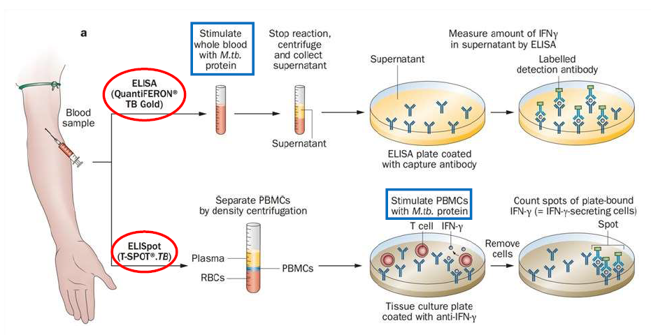

# IGRA 與 Latent TB 治療

## 原理概論

IGRA 是偵測宿主 T 細胞對 *M. tuberculosis* 特異抗原（ESAT-6、CFP-10，QuantiFERON 另加 TB7.7）反應的檢驗，曾感染或潛伏結核的個體，T 細胞會被這些抗原刺激而分泌 IFN-γ。目前臨床常用兩種平台，偵測方式不同但抗原基礎相同：

- **QuantiFERON-TB Gold（ELISA method）**
- **T-SPOT.TB（ELISPOT method）**

## QuantiFERON-TB Gold test（ELISA method）— 胸腔部

- Whole blood 直接以 *M. tuberculosis* 蛋白抗原刺激（抗原已包被於採血管內，採血後即可培養）。
- 培養後離心取上清液（血清），以 ELISA 定量上清液中 IFN-γ 濃度（吸光值）。

## T-SPOT.TB（ELISPOT method）— 免疫科

- 周邊血以密度梯度離心分離出 PBMC（周邊血單核細胞）。
- 將固定數量的細胞以 *M. tuberculosis* 蛋白抗原刺激 24 小時；有反應的抗原特異性細胞分泌 IFN-γ，結合於 plate 上預先包被的 anti-IFN-γ 抗體。
- 移除細胞後，plate 上的 spot 數目即代表樣本中 IFN-γ+ 細胞（抗原反應性 T 細胞）的數量。

## 兩者比較

| | QuantiFERON | T-SPOT |
|---|---|---|
| 抗原 | ESAT-6, CFP-10, TB7.7 | ESAT-6, CFP-10 |
| 採血管 | 抗原採血管 | Lithium Hepa 綠頭管（一般採血管即可） |
| 檢體處理 | 離心後取血清 | 定量調整細胞濃度（PBMC） |
| 品管數量 | 每批檢體 1 組品管 | 每個檢體 1 組品管 |
| 分析方法 | ELISA 讀取吸光值 | 顯微鏡／放大鏡肉眼判讀（可電腦擷取影像輔助） |

## 設計理念比較

兩者抗原皆為 ESAT-6 與 CFP-10；差異主要在於**操作流程的設計取向**：

- **QuantiFERON**：抗原直接包被於採血管內，可即刻培養，培養後離心取血清即可檢測，整體流程簡單、省人力，儀器判讀（ELISA 吸光值），發報告速度快；品管只需每批 1 組。
- **T-SPOT**：以一般綠頭管採血即可，但需另外分離 PBMC 並調整細胞濃度，確保刺激用的 T 細胞數量足夠，是為了提升準確性而設計；每一檢體都需獨立品管，結果需以顯微鏡或放大鏡人工判讀（可搭配電腦擷取影像），較耗人力與時間。

整體而言，**QuantiFERON 以操作簡便、節省人力、縮短報告時間為優勢；T-SPOT 以精準度為前提**，兩者各有優缺點，實驗室可依醫院量能與需求選擇平台。

## QuantiFERON-TB Gold Plus：結果判讀

| Nil | TB1 − Nil | TB2 − Nil | Mitogen − Nil | 定性結果 | 判讀 |
|---|---|---|---|---|---|
| ≤ 8.0 IU/mL | ≥ 0.35 且 ≥ 25% of Nil | Any | Any | **Positive** | 很可能有 *M. tuberculosis* 感染 |
| ≤ 8.0 IU/mL | Any | ≥ 0.35 IU/mL 且 ≥ 25% of Nil | Any | **Positive** | 很可能有 *M. tuberculosis* 感染 |
| ≤ 8.0 IU/mL | < 0.35 IU/mL 或（≥ 0.35 IU/mL 且 < 25% of Nil） | < 0.35 IU/mL 或（≥ 0.35 IU/mL 且 < 25% of Nil） | ≥ 0.5 IU/mL | **Negative** | 不太可能有 *M. tuberculosis* 感染 |
| ≤ 8.0 IU/mL | < 0.35 IU/mL 或（≥ 0.35 IU/mL 且 < 25% of Nil） | < 0.35 IU/mL 或（≥ 0.35 IU/mL 且 < 25% of Nil） | < 0.5 IU/mL | **Indeterminate** | 無法判定是否感染 *M. tuberculosis* |
| > 8.0 IU/mL | Any | Any | Any | **Indeterminate** | 無法判定是否感染 *M. tuberculosis* |

## 名詞說明

- **TB1 / TB2**：Gold Plus 版新增設計，將抗原管拆為兩管。TB1 為短胜肽，主要刺激 CD4+ T 細胞；TB2 額外含刺激 CD8+ T 細胞的序列，對免疫功能較弱族群（如免疫低下、老年）更敏感。判讀採 OR 邏輯：TB1、TB2 任一達陽性閾值即報 Positive。
- **T-SPOT 的 Panel A / Panel B**：T-SPOT 沒有 TB1/TB2 命名，而是把 ESAT-6（Panel A）與 CFP-10（Panel B）分開單獨測試，判讀同樣採 OR 邏輯。與 QuantiFERON 的分法邏輯不同：QuantiFERON 是「同抗原組合、拆細胞亞群（CD4 vs CD4+CD8）」，T-SPOT 則是「拆抗原種類、不特別分細胞亞群」。

## IGRA 陽性與 LTBI 的關聯

- IGRA 陽性代表曾感染 *M. tuberculosis*（免疫記憶存在），**但無法區分 active TB 或 latent TB（LTBI）**。LTBI 診斷 = IGRA（或 TST）陽性 **+** 排除 active TB（無症狀、影像正常、工作檢查陰性）。
- 優於 TST 之處：ESAT-6、CFP-10 為 *M. tuberculosis complex* 特有抗原，BCG 疫苗株與多數 NTM 皆無此抗原，故不受卡介苗接種史干擾，特異性較高。
- **IGRA 陰性不能排除 active TB**：其對 active TB 的敏感度並非 100%（文獻約 80–90%，隨檢驗版本與族群而異），嚴重免疫低下（如 HIV/CD4 極低、高劑量免疫抑制劑）、miliary TB、部分肺外結核、極端年齡族群易出現假陰性；懷疑 active TB 時仍須仰賴痰塗片／培養、NAAT、影像學診斷，不可單憑 IGRA 陰性排除。
- 風濕科意義：生物製劑（尤其 anti-TNF）治療前常規篩檢 IGRA，陽性且排除 active TB 後歸類為 LTBI，需先給予／併用預防性抗結核藥物（如 INH）再開始生物製劑，以降低治療後 latent TB 活化風險。
- **Nil（陰性對照）**：未加任何刺激物，測血液本底 IFN-γ 值；TB1、TB2、Mitogen 皆需扣除 Nil 值後才判讀，用以校正非特異性雜訊（避免假陽性）。
- **Mitogen（陽性對照）**：加入 PHA 等非特異性活化劑，不分抗原專一性刺激所有 T 細胞，用來確認受檢者 T 細胞本身有無能力產生 IFN-γ 反應。若 TB1、TB2 皆陰性、但 Mitogen−Nil 也偏低，代表淋巴球反應能力不足（如嚴重免疫抑制、淋巴球低下），此時應判為 Indeterminate 而非 Negative，以避免假陰性誤判。

## Latent TB 的治療

CDC / NTCA 建議：優先使用**短療程、rifamycin-based** 的 LTBI 治療處方，取代傳統 6–9 個月 isoniazid 單方治療（6H/9H）。短療程處方（3HP、4R、3HR）療效相當、安全性佳、**完治率較高**、**肝毒性風險較低**。

常用藥物：

- Isoniazid（INH）
- Rifapentine（RPT）
- Rifampin（RIF）

建議處方（依優先順序）：

1. **3HP**：Isoniazid + Rifapentine，每週一次，共 3 個月
2. **4R**：Rifampin，每日一次，共 4 個月
3. **3HR**：Isoniazid + Rifampin，每日一次，共 3 個月

## LTBI 治療與生物製劑併用時機

台灣健保給付規定（各生物製劑給付規範共同排除條件）明訂：

> 未經完整治療之結核病的病患（**包括潛伏結核感染治療未達四週者**，申請時應檢附潛伏結核感染篩檢紀錄及治療紀錄供審查）。

即 **LTBI 治療滿 4 週（1 個月）即符合申請生物製劑資格**，不需等整個 LTBI 療程（3HP 3 個月／4R 4 個月／3HR 3 個月）全部完成。滿 4 週後，生物製劑與剩餘 LTBI 療程**可併行使用**，不必先後分開進行，此原則也與國際（CDC/ATS）常見做法一致。

實務流程（如 RA 疾病活動度高、IGRA 陽性）：立即啟動 LTBI 治療 → 等待期間以現有 csDMARD 盡量控制病情 → 滿 4 週後檢附 IGRA 篩檢紀錄及治療紀錄申請生物製劑 → 核准後生物製劑與剩餘 LTBI 療程並行至療程結束。

## 3HP／4R／3HR 與風濕科用藥常見交互作用（DDI）

**Rifampin／Rifapentine（4R、3HP 皆含）— 強效 CYP3A4／P-gp 誘導劑**，會加速受質藥物代謝、使血中濃度大幅下降：

- **Glucocorticoids**（prednisolone 等）：代謝加速、療效下降，併用期間必要時需提高類固醇劑量。
- **JAK 抑制劑**（tofacitinib、upadacitinib）：屬 CYP3A4 受質，exposure 顯著下降，原廠仿單建議避免併用強效 CYP3A4 誘導劑；baricitinib 主要經腎臟排除、CYP3A4 依賴性較低，交互作用相對較小。
- **Calcineurin inhibitor**（cyclosporine、tacrolimus）：血中濃度大幅下降，若必須併用需大幅調高劑量並密切監測藥物濃度。
- **生物製劑**（anti-TNF、IL-6/17/23 inhibitors、abatacept、rituximab 等）：為蛋白質類藥物，經 catabolism 而非肝臟 CYP 代謝，**理論上與 rifamycin 類無顯著藥物動力學交互作用**，這也是滿 4 週後兩者可併行使用的重要原因之一。

**Isoniazid（3HP、3HR 皆含）— 主要風險為肝毒性疊加，非酵素誘導**：

- 與 **Methotrexate、Leflunomide** 併用：兩者皆有肝毒性，屬**加成性肝毒性風險**，需密切監測 LFT，必要時調整劑量或監測頻率。
- 周邊神經病變風險：建議併用 **Vitamin B6（pyridoxine）**預防。

**整理**

| 處方 | 主要機轉 | 高風險併用藥物 | 處理原則 |
|---|---|---|---|
| 4R | Rifampin：CYP3A4/P-gp 誘導 | 類固醇、JAK 抑制劑（tofa/upa）、cyclosporine/tacrolimus | 避免併用或調高劑量、密切監測 |
| 3HP | Rifapentine：CYP3A4/P-gp 誘導 ＋ Isoniazid：肝毒性 | 同上 ＋ MTX/Leflunomide（肝毒性疊加） | 同上 ＋ 監測 LFT、補充 B6 |
| 3HR | Rifampin：CYP3A4/P-gp 誘導 ＋ Isoniazid：肝毒性 | 同上 | 同上 |

NSAIDs、hydroxychloroquine、sulfasalazine 與上述三種處方**無顯著交互作用**，可正常併用。
