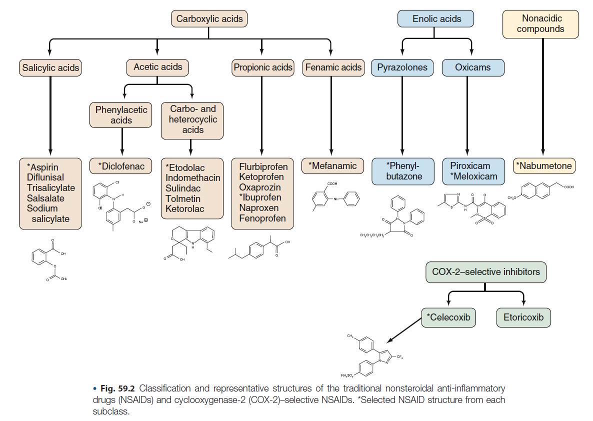

# NSAID/Aspirin Hypersensitivity 重點整理

來源：Middleton's Allergy 9th ed., Chapter 78 — Hypersensitivity to Aspirin and Other Nonsteroidal Antiinflammatory Drugs

## 快速複習

**病史詢問三大方向**：

- Onset：Acute 或 Delayed？
- 反應對象：對「單一 NSAID／單一 class」過敏，還是對「多種不同 class 的 NSAID」都過敏？
- 過去病史：是否有 atopy（asthma、rhinosinusitis、chronic urticaria）？

**Multiple NSAID Hypersensitivity**（對多種不同 class 的 NSAID 都過敏）：

- 並非 IgE-mediated hypersensitivity！！
- 機轉：Cyclooxygenase hypothesis（COX-1 inhibition）

**Management of Multiple NSAID Hypersensitivity**：

- 建議使用 acetaminophen 或 COX-2 inhibitors 作為止痛、退燒、抗發炎用藥。

---

## 一、分類架構（EAACI/GA2LEN 修訂分類）

NSAID hypersensitivity 依「急性 vs. 延遲性」、「cross-reactive（非過敏機轉）vs. single drug-induced（IgE-mediated）」區分：

| 時序 | 臨床表現 | 類型 | Underlying disease | 機轉 |
|---|---|---|---|---|
| 急性（暴露後立即~數小時） | Rhinitis/Asthma（AERD） | Cross-reactive | Asthma/rhinosinusitis | COX-1 inhibition |
| 急性 | Urticaria/Angioedema（AECD/NECD） | Cross-reactive | Chronic urticaria | COX-1 inhibition |
| 急性 | Urticaria/Angioedema（NIUA） | Cross-reactive | 無 underlying disease | 不明，可能仍是 COX-1 inhibition |
| 急性 | Urticaria/Angioedema/Anaphylaxis（SNIUAA） | Single drug-induced | Atopy/food allergy/drug allergy | IgE-mediated |
| 延遲性（>24小時，通常數天~數週） | 多器官（SNIDR） | Type IV | 通常無 | Cytotoxic T cells、NK cells |

備註：約 10-20% 病人表現為「blended」型，無法完全歸類。

整體盛行率：一般族群約 1-2%；歐洲 15 國調查（65,000 人）NSAID-induced dyspnea 平均盛行率 1.9%（0.9-4.8%）。

### 背景知識：NSAID 化學結構分類

判斷「多種 NSAID 是否化學結構真的不同」是病史詢問與 cross-reactivity 判讀的基礎，傳統 NSAID 依化學結構可分為 carboxylic acids（salicylic acids、acetic acids、propionic acids、fenamic acids）、enolic acids（pyrazolones、oxicams）、nonacidic compounds，以及另立一類的 COX-2-selective inhibitors。

（來源：Kelley's Textbook of Rheumatology 12E, Ch.59 — Therapeutic Targeting of Prostanoids）

---

## 二、AERD（Aspirin-Exacerbated Respiratory Disease）

### 歷史沿革

- 1902 Hirschberg 首次描述 aspirin hypersensitivity。
- 1968 Samter & Beers 定義「aspirin triad」（Samter's triad / Widal syndrome）。
- 1976 Szczeklik 提出 cyclooxygenase theory，說明致病機轉。

### 定義

Triad：慢性 rhinosinusitis 併 nasal polyp、中重度 asthma、對 aspirin 及其他 cross-reacting NSAIDs 過敏反應。

**自然病程（時序）**：先出現 persistent rhinosinusitis（常合併 polyposis）→ 接著出現 asthma（約同時期診斷）→ 最後才出現 aspirin hypersensitivity。核心問題並非 aspirin 過敏本身，而是慢性發炎性呼吸道疾病；因此現用「AERD」一詞強調 chronicity，而非舊稱「aspirin-induced asthma」。

### 流行病學

- 成人 asthma 中 AERD 盛行率 7.2%，severe asthma 中升高至 14.9%。
- Nasal polyp/chronic rhinosinusitis 病人中 ASA hypersensitivity 約 8.7-9.7%（舊估計可達 30%）。
- 兒童 asthma：病史推估 1-3%，oral provocation 確診約 5%。
- 女性 > 男性，比例約 3:2。

### 致病機轉

**1. Cyclooxygenase hypothesis（急性反應機轉）**

Aspirin/NSAID 抑制 COX-1 → PGE2 生成減少 → 失去對 mast cell、eosinophil 及 5-LOX 的抑制/穩定作用 → cysteinyl leukotrienes（LTC4、LTD4、LTE4）大量釋放 → 誘發 bronchoconstriction、rhinorrhea、congestion、urticaria、angioedema。

重要佐證：

- 只有 strong/moderate COX-1 inhibitors 會誘發反應；弱抑制劑（salicylic acid、acetaminophen 低劑量）與 selective COX-2 inhibitors 通常可耐受。
- Nasal polyp epithelial cells、bronchial fibroblasts 中 PGE2 生成顯著下降。
- 吸入 PGE2 可預防 aspirin 誘發的 cysteinyl leukotriene 釋放及支氣管收縮（保護角色）。

**2. Leukotriene overproduction**

- AERD 病人基礎尿中 leukotriene metabolites 即高於 ASA-tolerant asthmatics（未激發狀態下已升高）。
- Bronchi 中表現 LTC4 synthase（LTC4S）的細胞數（尤其 eosinophils）增加。
- Nasal polyp 中 CysLTR1（type 1 cysteinyl leukotriene receptor）表現上升，代表局部對 leukotriene 反應性增加。

**3. 15-lipoxygenase pathway**

- Lipoxin A4（LXA4，抗發炎代謝物）在 AERD 病人周邊血白血球及 nasal polyp 中生成減少，15-LOX 表現上升——角色尚不明確，可能是 proinflammatory 或 modulatory。

**4. 慢性發炎機轉（與 NSAID 暴露無關）**

- Airway disease 通常先於 aspirin hypersensitivity 出現；即使完全避開 NSAID，慢性發炎仍不會改善——顯示慢性發炎為 aspirin hypersensitivity 的必要條件，而非結果。
- Tissue eosinophilia、mast cell infiltration 為上下呼吸道黏膜共同特徵；IL-5、GM-CSF、RANTES、eotaxins 上調，促進 eosinophil 存活。
- Aspirin 誘發反應時，eosinophils 與 ILC2s（group 2 innate lymphoid cells）於鼻黏膜急性增加。
- Platelet-leukocyte aggregates 增加，透過 transcellular conversion 促進全身性 leukotriene 生成。
- 環境誘因假說：rhinovirus（AERD 病人支氣管上皮 100% 可測得 rhinovirus mRNA，ASA-tolerant asthma 僅 73%）；Staphylococcal enterotoxin 特異性 IgE 可能參與慢性 eosinophilic inflammation 之維持。

**5. 基因機轉**

- HLA-DPB1*0301：波蘭及韓國族群中 AERD 之強遺傳標記，帶此 allele 者 FEV1 較低、鼻息肉盛行率高。
- HLA-DRB1*1302-DQB1*0609-DPB1*0201 haplotype：韓國族群 aspirin-induced urticaria 之標記。
- 其他候選基因：LTC4S、CYSLTR1、CYSLTR2、CRTH2、CCR3、MS4A2R（FcεR1β）、ACE、IL4 等 SNP，多與 leukotriene 生成、eosinophil/mast cell activation 相關（詳見原文 Table 78.2）。

### 臨床特徵

- 中重度 asthma + 慢性 rhinosinusitis + 反覆 nasal polyp。
- NSAID 誘發呼吸道症狀，可合併眼、皮膚（flushing、urticaria/angioedema）或腸胃症狀（blended/mixed reaction）。
- 顯著 blood/nasal/sputum eosinophilia；bronchial biopsy 見 eosinophil infiltration、IL-5+ 細胞增加（但 serum IL-5 多正常）。
- 部分病人 total IgE 偏高（非因 atopy），與 staphylococcal superantigen 特異性 IgE 有關。
- Nasal polyp 易「快速復發」，平均每人需 3 次 sinus surgery/polypectomy。
- **NSAID hypersensitivity 是 severe chronic asthma 及 near-fatal asthma 的重要危險因子**：TENOR study 顯示 AERD 病人（n=459）相較 aspirin-tolerant asthmatics（n=2824），postbronchodilator FEV1% predicted 較低、較常有 severe asthma episode、氣管插管病史、近 3 個月需 steroid burst、較常使用高劑量 ICS。

### 診斷

**Gold standard：Provocation/challenge test**（無 in vitro 診斷方法可用於例行臨床）

共 4 種途徑：oral、inhalation（bronchial）、nasal、intravenous。

前提條件：asthma 須穩定、baseline FEV1 ≥ 70% predicted；需事先停用相關藥物（見下表）；oral corticosteroid 若須維持，劑量不可超過 prednisolone 10 mg。

**激發前停藥時間**：

| 藥物 | 停藥時間 |
|---|---|
| Short-acting β2-agonist、ipratropium | 6小時（可到8小時） |
| Long-acting β2-agonist、long-acting theophylline、tiotropium | 24小時（可到48小時） |
| Short-acting antihistamine | 3天 |
| Cromolyn sodium | 8小時 |
| Nedocromil sodium | 24小時 |
| Leukotriene modifiers | 至少1週 |

**1. Oral challenge（美國：唯一可用途徑；為 gold standard）**

劑量遞增（每次間隔 1.5-2 小時，累積總劑量 500-600 mg）：

| 時間 | 劑量 |
|---|---|
| 起始 | 40.5 mg |
| +90分鐘 | 81 mg |
| +3小時 | 162 mg（累積） |
| +4.5小時 | 325 mg（累積） |

- 若病史有嚴重反應（severe dyspnea/anaphylactic shock），起始劑量可降至 10 mg，再以 20 mg 接續。
- 陽性反應：FEV1 下降 ≥20%，或出現明顯 extrabronchial 症狀（嚴重鼻塞、明顯流鼻水）。
- 陰性反應：累積劑量達 500-600 mg，FEV1 下降 <15% 且無鼻眼症狀。

**2. Bronchial（inhalation）challenge**（歐、亞洲常用；較快、較安全，但敏感度略低於 oral）

- 使用 lysine-aspirin（可溶性合成 aspirin 類似物）經 dosimeter-controlled nebulizer 遞增劑量，每 30 分鐘一次，FEV1 每 10 分鐘量測。
- 陽性：FEV1 下降 >20%（可計算 PC20）。
- 通常建議先做 placebo challenge。

**3. Nasal challenge**

- 使用 lysine-aspirin（16 mg）滴鼻，或新式 ketorolac nasal spray（2.26 mg/spray，遞增劑量）。
- 較安全，極少全身反應；適合以鼻部症狀為主或 asthma 嚴重不適合 oral/inhalation 者。
- 敏感度較低，陰性結果建議進一步做 oral/inhalation confirm。
- Septal perforation 或明顯鼻塞（polyp）者不適合。

**4. Intravenous challenge**

- Lysine-aspirin 遞增劑量（12.5, 25, 50, 100, 200 mg，每 30 分鐘）。

**In vitro tests（皆非常規推薦）**：Basophil activation test（CD63 expression）、aspirin-triggered 15-HETE release from peripheral leukocytes（ASPITest）——敏感度/特異度不穩定，尚待大型研究驗證。

### 治療

**1. 避免與替代藥物選擇**

| 分組 | 內容 |
|---|---|
| Group A：多數過敏病人會 cross-react（60-100%） | Ibuprofen, indomethacin, sulindac, naproxen, fenoprofen, meclofenamate, ketorolac, etodolac, diclofenac, ketoprofen, flurbiprofen, piroxicam, nabumetone, mefenamic acid |
| Group B：少數會 cross-react（2-10%） | Rhinitis/asthma type：acetaminophen（<1000mg劑量下）、meloxicam、nimesulide；Urticaria/angioedema type：acetaminophen、meloxicam、nimesulide、selective COX-2 inhibitors（celecoxib, rofecoxib） |
| Group C：多數病人可耐受 | Rhinitis/asthma type：selective COX-2 inhibitors（celecoxib, parecoxib）、trisalicylate、salsalate；Urticaria/angioedema type：新一代 selective COX-2 inhibitors（etoricoxib, parecoxib） |

- 安全首選止痛藥：Acetaminophen（>1000mg 仍可能有輕度呼吸道反應）、celecoxib、codeine。
- 極弱 COX 抑制劑（azapropazone, choline magnesium trisalicylate, salsalate）多數可耐受。
- Nimesulide、meloxicam 雖屬 preferential COX-2 inhibitor（非 selective），仍建議首劑於診間內給藥觀察。

**2. Asthma 治療**：依標準 asthma guideline 處理，常需高劑量 ICS + LABA ± 口服類固醇 burst/daily。

- Antileukotrienes：
  - Zileuton（5-LO inhibitor）：6週治療改善肺功能、減少 rescue bronchodilator 使用、恢復嗅覺。
  - Montelukast 10mg/day × 4週：改善 asthma control、FEV1 增加 10.2%；亦可減緩 lysine-aspirin 誘發之鼻部反應、減少口服類固醇需求。
  - 注意：AERD 病人對 LTRA 的反應「並未」優於 aspirin-tolerant asthmatics（與預期相反）。

**3. Chronic rhinosinusitis/nasal polyp 治療**：高劑量 intranasal steroid（長期）、細菌感染時抗生素、口服類固醇 burst（"medical polypectomy"）、decongestant/antihistamine 輔助；反覆需 functional endoscopic sinus surgery，惟術後 polyp 易快速復發。

**4. Aspirin desensitization**

- 適用於 AERD 合併上下呼吸道發炎控制不佳者。
- 機轉未完全清楚：推測與降低對吸入 LTE4 之支氣管反應性、降低尿中 PGD2 metabolites 有關。
- 原理：急性反應後進入 refractory period（2-5天），此期間可耐受 aspirin；透過每日持續給藥可維持此耐受狀態（此過程稱 desensitization）；停藥 2-5 天後耐受性即消失。
- 劑量遞增流程類似 oral challenge，最終維持劑量常為 650-1300 mg/day。
- **依適應症不同的目標劑量**：
  - 81 mg qd：心血管疾病預防
  - 325 mg qd：維持對所有 NSAID 的 cross-desensitization
  - 650 mg bid（起始）：治療 AERD 之呼吸道疾病，症狀控制後可於 1-6 個月後降至 325 mg bid
- 好處：改善嗅覺、減少上下呼吸道症狀、減少化膿性鼻竇炎、減少再手術需求、減少住院及類固醇使用。
- 約 15-20% 病人因副作用（多為 gastritis）而停用每日 aspirin。
- Desensitization 狀態下，aspirin 及多數 strong NSAID 皆可耐受，故也可用於合併 rheumatic disease/chronic pain 病人的治療（一舉兩得）。

---

## 三、NECD / NIUA（NSAID-Exacerbated Cutaneous Disease／NSAID-Induced Urticaria-Angioedema）

### 定義

- **NECD**：慢性 urticaria 病人於暴露 ASA/NSAID 後皮膚症狀惡化（cross-reactive across COX-1 inhibitors）——慢性 urticaria 病人中高達 35% 會有此惡化現象。
- **NIUA**：無慢性 urticaria 病史者，暴露 ASA/NSAID 後才出現急性 urticaria/angioedema（cross-reactive）。
- 兩者皆非免疫機轉，機轉推測仍與 COX-1 inhibition 有關。

### 臨床特徵

- 通常服藥後 1-4 小時出現（少數延遲至 24 小時內）。
- 合併 angioedema 時症狀較重，常見 facial（periorbital）angioedema。
- NIUA 病人 atopy 為易感因子；10 年追蹤顯示演變成慢性 urticaria/angioedema 的比率（約6%）與一般族群相近（並非必然進展為慢性病）。

### 機轉

- COX-1 inhibition → PGE2 減少 → 皮膚發炎介質釋放增加。
- 慢性 urticaria 合併 NSAID intolerance 者，基礎尿中 LTE4 已較高，aspirin 激發後更上升；leukotriene receptor antagonist 可抑制此類反應。
- 常合併 autologous serum/plasma skin test 陽性，暗示與 autoimmunity 相關。
- 基因：ADORA3 promoter polymorphism（−1050 G/T）與 aspirin-intolerant urticaria 相關；FCER1G −237G 與 atopy/basophil histamine releasability 相關；HNMT 939A>C 與 NECD phenotype 相關。

### 診斷與治療

- 病史為主，確診需 oral challenge test（無可靠 in vitro test）。
- 治療：避開所有 strong COX-1 inhibitors，改用 acetaminophen 或 COX-2 inhibitor（但高劑量仍可能誘發）；NECD 依現行 chronic urticaria guideline 階梯式使用 antihistamine。
- **NECD/NIUA 病人一般不建議 aspirin desensitization**（成功案例罕見報告）。

---

## 四、SNIUAA（Single NSAID-Induced Urticaria/Angioedema/Anaphylaxis）— IgE-mediated

- 對「單一」NSAID（非 cross-reactive）產生急性 urticaria/angioedema/anaphylaxis，機轉為 IgE-mediated（已於 pyrazolones 證實有藥物特異性 IgE）。
- 確診需在醫院控制下以致病藥物 + 另一化學結構不同的 NSAID 分別做 oral challenge。
- 若確認陽性，須嚴格避開致病藥物及化學結構相近藥物；替代 NSAID 使用前應先做 challenge 確認耐受性。
- **不建議 aspirin desensitization**（與此類反應/anaphylaxis 無關的處置方式）。

### Cross-reactor 處置流程（Fig. 78.3 演算法）

1. 病史為多重 NSAID 反應 → confirmatory oral challenge with COX-1 inhibitor：
   - 陽性 → 視為 multiple NSAID reactor → 避開所有 NSAID
   - 陰性 → 再以化學結構不同的 NSAID challenge，陽性同樣視為 multi-reactor，陰性則可個別管理
2. 病史為單一 NSAID 反應 → oral challenge with 替代（非 COX-1 inhibitor）NSAID：
   - 陽性 → 視為 multi-reactor
   - 陰性 → 可依個別藥物管理

---

## 五、延遲性反應（SNIDR, Single NSAID-Induced Delayed Reactions）

定義：暴露後 >6 小時才出現（常數天至數週），機轉為 Type IV（T cell-mediated，Pichler 分型 IVa-IVd）。停藥後緩解也需數天至數週。

| 臨床型態 | 特徵 | 常見致病藥物 |
|---|---|---|
| Fixed drug eruption（FDE） | 約占所有藥物反應 10%；同一部位每次重複發作（唇、手、生殖器、口腔黏膜最常見）；NSAID 占 FDE 約 30% | Pyrazolones、piroxicam、phenylbutazone、paracetamol、aspirin、mefenamic acid、diclofenac、indomethacin、ibuprofen、diflunisal、naproxen、nimesulide |
| Maculopapular eruption（MPE） | 最常見藥物疹型態之一；紅斑丘疹，主要於軀幹、近端肢體 | Ibuprofen、pyrazolones、flurbiprofen、diclofenac、celecoxib |
| Contact/photocontact dermatitis | 局部搔癢紅斑病灶，多因外用 NSAID | Diclofenac、aceclofenac、indomethacin、flurbiprofen、bufexamac、etofenamate、flufenamic acid、ibuprofen、ketoprofen、mefenamic acid；外用致敏後全身使用同藥可致 systemic contact dermatitis |
| SJS/TEN | 發燒＋廣泛紅斑丘疹→壞死性水泡、表皮剝離；SJS <10% 體表、TEN >30% 體表 | Oxicams、phenylbutazone、oxyphenbutazone、naproxen、aspirin、ketoprofen；近年 sulfonamide COX-2 inhibitors（valdecoxib、celecoxib）亦有報告 |
| DIHS（drug-induced hypersensitivity syndrome） | 嚴重疹＋發燒＋淋巴腺病＋肝炎＋血液學異常＋eosinophilia、atypical lymphocytes | NSAID 少見；其中以 ibuprofen 最常報告 |
| AGEP | 瀰漫紅斑水腫上非毛囊性無菌膿皰，好發皮膚皺褶/顏面；常合併發燒、neutrophilia | 少見於 ibuprofen、nimesulide、celecoxib、etoricoxib、valdecoxib、metamizole、paracetamol |

### 診斷

- 依臨床特徵（症狀、病灶型態分布）。
- 確診工具：intradermal test、patch test（未標準化）、drug provocation test（僅適用輕症，重症禁忌）、skin biopsy（鑑別診斷用）；lymphocyte transformation test 尚未驗證。
- Photopatch test：懷疑 photosensitivity 時使用。

### 治療

- 立即停用致病藥物，支持性治療（症狀治療、類固醇、抗組織胺）。
- SJS/TEN 需加護病房治療；parenteral steroid、plasmapheresis、IVIG、免疫抑制劑效果尚有爭議；anti-TNF-α（infliximab）已被提出使用。
- 建議尋找化學結構不同之替代 NSAID，於醫療監督下使用。
- **Aspirin desensitization 不建議用於延遲性反應**。

---

## 六、臨床情境範例：病人主訴多種 NSAID 過敏合併皮膚搔癢紅疹

情境：病人來門診主訴吃了好幾種 NSAID 都會過敏，皮膚癢、起紅疹。此病史型態（多種 NSAID 誘發 urticaria）需優先分辨是 **cross-reactive type（NECD/NIUA）**，還是巧合、或延遲型反應（FDE/MPE）。

### 病史詢問重點

**1. 釐清「多種」NSAID 是否化學結構真的不同**

- 請病人具體說出藥名（很多病人只知道「止痛藥」）。若都是同一 chemical group（如都是 propionic acid 類：ibuprofen + naproxen），意義和「跨越多個不同化學結構」不同——後者才是典型 cross-reactive pattern 的證據。
- 是否曾經安全使用某些止痛藥？特別問 acetaminophen（普拿疼）、celecoxib——這對後續選替代藥物很關鍵。

**2. 反應的時序（急性 vs 延遲）**

- 服藥後多久出現症狀？
  - 1–4 小時內出現 → 典型 acute cross-reactive urticaria/angioedema（NECD/NIUA）型態。
  - >6 小時，甚至數天才出現 → 要考慮 delayed-type（SNIDR），尤其若皮疹型態是 fixed drug eruption（FDE，同一部位每次固定復發，好發唇、手、生殖器）或 maculopapular eruption。

**3. 症狀嚴重度與是否曾經有 anaphylaxis 徵象**

- 除了皮膚癢疹，是否合併：angioedema（尤其眼周、嘴唇腫）、呼吸道症狀（喘、喉頭緊）、頭暈、血壓下降、暈厥。
- 這決定風險分級，也決定日後 challenge test 是否安全執行、是否需要開立 epinephrine auto-injector。

**4. 是否有「不吃藥時」也會自發性起疹子的病史**

- 這是分辨 NECD（有 underlying chronic urticaria，NSAID 只是誘發惡化）vs NIUA（本身沒有慢性蕁麻疹，只有吃 NSAID 才發作）的關鍵問題。兩者處置原則相同，但 NECD 需同時處理 baseline chronic urticaria。

**5. Atopy／過敏體質病史**

- Allergic rhinitis、氣喘、食物過敏、其他藥物過敏史——NIUA 病人 atopy 是易感因子。

**6. 呼吸道相關病史（別忘了問，即使主訴是皮膚）**

- 是否有氣喘、慢性鼻竇炎、鼻息肉（nasal polyp）？因為 cross-reactive 機轉（COX-1 inhibition）在同一個病人身上，呼吸道與皮膚表現可能同時並存或先後出現（AERD 與 NECD/NIUA 常合併）。

**7. 劑量相關性**

- 低劑量 aspirin（如 81 mg 心臟保護劑量）是否也會誘發？這與後續選擇替代藥物、劑量閾值有關。

**8. 目前是否有臨床上「必須用到 NSAID」的需求**

- 例如同時有痛風、退化性關節炎、需要長期止痛——會影響是否要積極安排 challenge test 找出安全替代藥。

### 後續處置

**Step 1：先做風險分層**

若病史清楚符合「多種不同化學結構 NSAID → 1–4 小時內 urticaria/angioedema，無呼吸道／循環性 anaphylaxis 徵象」→ 臨床上通常不需要再做激發測試即可診斷為 cross-reactive type（NECD 或 NIUA），因為病史本身已具診斷力（見 Fig. 78.3 演算法）。

若病史不清楚（例如只吃過一種 NSAID、或懷疑只是巧合），才需轉介過敏科做 confirmatory oral challenge（在有急救設備的醫療院所執行）。

**Step 2：衛教避免藥物——依 Box 78.1 分組**

| 分組 | 建議 |
|---|---|
| 應避免（Group A，強 COX-1 抑制劑，60–100% cross-react） | Ibuprofen、naproxen、diclofenac、indomethacin、ketorolac、mefenamic acid、piroxicam、ketoprofen、flurbiprofen 等 |
| 謹慎使用，首劑建議診間監測（Group B，2–10% cross-react） | Meloxicam、nimesulide、acetaminophen（尤其 >1000 mg）、selective COX-2 inhibitor（celecoxib） |
| 多數可耐受的替代選擇（Group C） | Acetaminophen（<1000 mg）為首選；celecoxib、新一代 selective COX-2 inhibitor（etoricoxib）次選 |

實務上：先建議 acetaminophen 作為安全止痛藥；若需要更強效抗發炎效果（如關節炎），可考慮在診間監測下先試單次低劑量 celecoxib，觀察 1–2 小時。

**Step 3：處理 underlying disease（若為 NECD）**

若病人本身就有慢性蕁麻疹病史，依現行 chronic urticaria guideline 給予階梯式 antihistamine 治療；控制好 baseline urticaria 有助於減少 NSAID 誘發惡化的頻率與嚴重度。

**Step 4：關於 Aspirin Desensitization**

不建議——NECD/NIUA 病人做 aspirin desensitization 的成功案例罕見報告，這與 AERD（呼吸道疾病）病人可考慮 desensitization 不同，兩者處置原則不要混淆。

**Step 5：安全網與轉介**

- 病歷/藥物過敏系統上明確註記「NSAID cross-reactive hypersensitivity」，避免未來被開立到 Group A 藥物。
- 若曾有 angioedema 或疑似 anaphylaxis 病史，評估是否需開立 epinephrine auto-injector 並衛教使用方式。
- 若診斷不確定、或病人有強烈臨床需求要用到某支特定 NSAID（例如合併需要 aspirin 做心血管保護），轉介過敏免疫科安排正式 oral challenge 確認安全性，而非自行嘗試。

**一句話總結**：病史詢問核心在「時序（急性 vs 延遲）」＋「跨越幾種不同化學結構藥物」＋「是否本身就有慢性蕁麻疹」；處置核心是衛教避開 Group A 藥物、首選 acetaminophen 作替代、有需要時轉介做正式 challenge，NECD/NIUA 皆不建議 aspirin desensitization。
