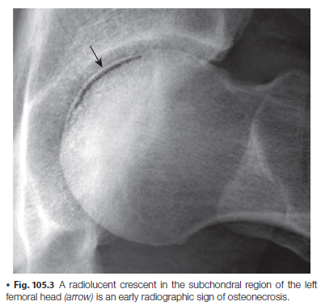

# Osteonecrosis（骨壞死）重點整理

## 一、定義與流行病學

**定義**：骨壞死（osteonecrosis）＝ossis（骨）+ necrosis（壞死），同義詞包含 avascular necrosis、ischemic necrosis of bone、aseptic necrosis、subchondral avascular necrosis。最終共同致病路徑（final common pathway）為**骨骼血流供應中斷**。

**流行病學重點**：

- 美國每年新診斷約 10,000–20,000 例
- 創傷性股骨頸骨折後發生率 24–39%
- 約占美國每年 500,000 例髖關節置換手術中的 10%
- **男性 > 女性**，但合併 SLE 者例外（女性較多）
- 好發第 3–5 個十年（青壯年），因此長期病程負擔重（人工關節有使用年限）
- Osteonecrosis of the jaw（ONJ）與 bisphosphonate 相關，西班牙研究中口服使用者占 25%、IV 使用者占 75%

---

## 二、病因（Etiology）

Trauma 約占 20%；nontraumatic osteonecrosis 中最常見原因為 **corticosteroid**。

### （一）類固醇相關（最重要）

- 1998 年約 3000 例 nontraumatic osteonecrosis 研究：corticosteroid 占 34.7%，alcohol 占 21.7%，其餘 idiopathic
- Cumulative dose 與時間關係不一致，**無法定義安全劑量**，但風險與劑量相關，long-acting steroid、parenteral 使用風險較高

**2017 ARCO 類固醇相關 osteonecrosis 分類準則**：

1. 使用史：≥ 2 g prednisolone-equivalent／3 個月內
2. 診斷需在使用後 2 年內
3. 需排除其他病因

### （二）酒精與吸菸

**2017 ARCO 酒精相關診斷準則**：飲酒 >400 mL（320 g 純酒精）/週，持續 6 個月，診斷須在停止後 1 年內，且排除其他病因

### （三）Dysbaric osteonecrosis（潛水夫病）

- 潛水員盛行率 4.2%，高壓作業者 17%
- 與減壓病（the bends）機轉不同，正確減壓程序**不能**預防此病
- 可在暴露後數月至數年才發病；除股骨頭外，脛骨、肱骨頭/幹也常見

### （四）感染

- SARS：許多患者因治療接受類固醇而發生 osteonecrosis，發生率高於其他使用類固醇族群；兒童 SARS 患者亦有報告
- SARS-CoV-2 感染後也可見（機轉不明，可能與 steroid 使用或病毒本身內皮損傷有關）
- HIV（11,820 例大型跨國世代）：89 例 osteonecrosis，危險因子包括高齡、低 BMI、白種人、IV 藥癮、低 CD4、既往骨折/osteonecrosis、心血管病、非 AIDS 癌症、HCV 共感染

### （五）自體免疫疾病與凝血病

- 中國 11 年單中心 SLE 世代（1158 例）：88 例（7.6%）發生 osteonecrosis
  - 危險因子：年輕、疾病較嚴重、初期高劑量 prednisolone、**較少使用 hydroxychloroquine**
  - Antiphospholipid antibody：multisite osteonecrosis 危險因子（OR 6.28）

---

## 三、臨床表現

### 骨壞死本身

- 主要症狀為**疼痛**，早期可無症狀
- 股骨頭壞死：疼痛位於髖部，可放射至鼠蹊部、大腿前側、膝蓋
- 突發劇烈疼痛：見於創傷、Gaucher's disease、dysbarism、hemoglobinopathy 造成的大範圍梗塞
- 對側髖關節後續發生率 31–55%
- 好發部位（除股骨頭外）：肱骨頭（第二常見）、股骨髁、近端脛骨、腕/踝、手足骨、脊椎、下顎骨、顏面骨
- **Kienböck's disease**＝月狀骨（lunate）osteonecrosis，與勞力工作相關
- 足球員可見足部骨壞死；美式足球員髖部骨壞死風險增加

### Bone marrow edema（骨髓水腫）

- 常伴隨 osteonecrosis，但**非特異性**（也見於 osteomyelitis、OA、應力性骨折、骨質疏鬆、鐮刀型貧血危象）
- **Bone marrow edema syndrome**：目前認為是獨立疾病實體，非 osteonecrosis 前驅病灶
  - 好發中年男性、懷孕第三孕期女性
  - 三階段病程：初期（~1個月）→ 平原期（1–2個月）→ 消退期（4–6個月）
  - **不會發生 subchondral fracture**
  - 動態顯影 MRI（perfusion pattern）可區分：BME 為高 PF/低 MTT（周圍低 PF/長 MTT）；osteonecrosis 為無 PF/MTT（周圍高 PF/中等 MTT 環繞）
  - 治療：bisphosphonate、denosumab 有不錯效果

### Bisphosphonate / Denosumab 與 ONJ

- 僅含氮 bisphosphonate 與 ONJ 相關
- 下顎骨特別脆弱，可能因高骨轉換率或藥物同時作用於周邊組織（fibroblast、血管）
- 其他相關藥物：raloxifene（SERM）、denosumab（anti-RANKL 單株抗體）
- 德國分析 1229 例 ONJ（2004–2012）：81% 使用 zoledronate 時發病；男性發病較早
- 放射線引起 ONJ 診斷準則：暴露骨壞死持續 ≥8 週 + 曾接受 ≥50 Gy 放射線 + 無 bisphosphonate 使用史

### 小兒骨壞死

- ALL（急性淋巴性白血病）患兒：發生率 1.6–17.6%，青少年風險最高；高 BMI 為額外危險因子
- Sickle cell disease 兒童：機轉為 watershed zone 血管阻塞；osteonecrosis 發生率與 6 年內 vaso-occlusive crisis 次數相關
- **Legg-Calvé-Perthes (LCP) disease**：3–12 歲兒童，常見雙側侵犯，與創傷、先天性髖脫臼、transient synovitis 相關

---

## 四、分期系統（Staging）

**Modified Steinberg Staging（簡表）**：

- I：X 光正常，但骨掃描/MRI 異常（可逆）
- II：lucent/sclerotic 變化（可逆）
- III：subchondral fracture 無扁平化（不可逆）
- IV：subchondral fracture 合併扁平化或節段性凹陷（不可逆）
- V：joint space narrowing 或 acetabular 變化（不可逆）
- VI：晚期退化性變化（不可逆）

**重點**：早期分期可逆，晚期分期一律不可逆。

---

## 五、致病機轉（Pathogenesis）

### （一）創傷性骨壞死

- 股骨頭血供來自三套動脈網（retinacular arteries 供應 80% 股骨骨骺）
- Retinacular artery 受損 → anterosuperior 股骨頭好發壞死
- 病理過程：infarct → sclerosis 邊緣形成 → subchondral fracture（若在承重區）→ 反覆微骨折無法癒合 → 股骨頭扁平化、塌陷 → 髖臼摩擦破壞 → 關節結構全面崩解

### （二）非創傷性骨壞死（多重機轉）

被比喻為髖關節的「冠狀動脈疾病」。

**1. Osteoimmunologic factors（骨免疫學因子）**

- 涉及 RANK/RANKL、IL-1、IL-6、IL-10、TGF-β、TNF、CD80/86/40、M-CSF、NFATc、vitamin D
- Glucocorticoid 透過影響骨恆定調控因子轉錄 → 解釋類固醇致病機轉
- TLR4 signaling 上調 → osteoclast 活化（先天免疫角色）
- IL-9 上升與軟骨降解相關（Jak-Stat pathway）
- **Th17 / IL-17** 過度表現，與疼痛嚴重度相關
- Sclerostin 下降
- IL-33 可能作為 biomarker
- IL-6 可刺激再血管化與新骨形成（潛在治療標的）

**2. Osteoblast/Osteoclast balance**

- 酒精降低 mesenchymal stem cell 分化為 osteoblast 的能力（酒精性、idiopathic 骨壞死中降低；類固醇性反而略升高但無統計意義）
- Osteonecrosis 患者的 osteoblast proliferation rate 較 OA 患者低（分化不受影響）

**3. Apoptosis**

- Prednisolone 誘導 osteoblast 與 osteoclast 的 metaphyseal apoptosis 增加 → 骨轉換率、骨密度下降
- 缺血誘發 stress protein、oxygen-regulated protein、hemoxygenase 1 表現上升 → DNA fragmentation、apoptotic bodies（軟骨細胞、骨髓細胞、osteocyte）
- 酒精與類固醇皆可誘導 osteocyte apoptosis（可能透過脂質代謝異常）

**4. Lipids（脂質異常）**

- 酒精/類固醇皆造成骨髓脂肪浸潤（fatty infiltration）、adipocyte 肥大增生、osteocyte 內三酸甘油脂沉積

**5. Coagulopathy（凝血病）**

- 高脂血症、游離脂肪酸、prostaglandin 上升 → 血管發炎與凝血
- Osteonecrosis 患者：82% 至少 1 項凝血指標異常，47% ≥2 項異常（正常對照組僅 30%／2.5%）
- 相關凝血因子：free protein S、protein C、lipoprotein A、homocysteine、PAI、tPA、anticardiolipin Ab、activated protein C resistance
- 類固醇透過**hypofibrinolysis**致病：↑PAI、↓tPA activity → 高凝血傾向

**6. Oxidative stress（氧化壓力）**

- 酒精降低 superoxide dismutase 活性

**7. Nitric oxide synthase**

- Glucocorticoid 干擾血管對 NO 的反應性；NO 為血管擴張劑並抑制血小板凝集，缺陷可致血管阻力增加

### （三）血管與機械因素

- LCP disease：靜脈回流阻塞 → intraosseous pressure 上升 → 缺血 → 骨骺軟骨骨化停止
- Dysbaric osteonecrosis 機轉未明：氣泡致動脈阻塞、血小板凝集、脂質聚合、纖維蛋白栓子等多重因素

---

## 六、診斷

### 病史與理學檢查

應詢問：創傷史、潛在疾病、飲酒/吸菸、目前及過去用藥、關節異常史、疼痛/活動受限、運動（尤其高衝擊）、職業史、妊娠史、肝病/血脂異常。
**Harris hip score**：8 項評估（疼痛、行走、日常活動、關節活動度），0（最差）–100（正常），可監測治療效果。

### 影像學

| 檢查 | 早期徵象 | 說明 |
|---|---|---|
| **X 光** | Crescent sign（新月狀 subchondral 透亮帶） | 早期可完全正常；出現時已不可逆；frog-lateral view 可加強觀察 |
| **骨掃描（Tc-99m MDP）** | 早期敏感，"cold in hot" 表現 | 中心壞死區攝取降低/缺乏，周圍反應性骨形成攝取增加 |
| **CT** | **Asterisk sign（星號徵）** | 詳細評估股骨頭結構、可見晚期塌陷 |
| **MRI** | 最敏感、目前**診斷金標準** | T1 低訊號、T2 高訊號；**Double-line sign**（T2 上外圈低訊號 + 內圈高訊號）；可偵測骨髓水腫；分期系統多以 MRI 為基礎 |
| Arthroscopy | — | 可偵測 X 光/MRI 未發現之 36% 塌陷股骨頭軟骨退化 |

**MRI 評估股骨頭侵犯範圍三種技術**：

1. 侵犯比例分級：<15%、15–30%、>30%
2. Necrotic arc angle（壞死弧角，冠狀面 A + 矢狀面 B）
3. 以最大病灶切面測量弧角

### 病理學

- 早期組織學徵象：骨髓**脂肪壞死**（fat necrosis）為最先出現的組織學表現
- 脂肪經 lipid encystification 後被 amorphous material（鈣化 calcium soaps）取代
- 壞死/存活交界處骨吸收活性增加（osteoclastic activity）
- **Creeping substitution**：存活骨在壞死骨邊緣沉積新骨，形成 arrest cement line

### Biomarker

目前**缺乏可靠 biomarker**。血清/尿液 CTX（carboxy-terminal cross-linking telopeptide）可用於評估 bisphosphonate ONJ 風險（非特異性）；血清 osteocalcin 於 BRONJ 患者較低，可作預測指標。

---

## 七、自然病程

- 無症狀且 X 光正常者：5 年內僅 1/23 髖進展至有症狀+影像異常（進展緩慢）
- 已有 X 光異常者：5 年內 14/19 進展至疼痛
- Stage 1 病灶（MRI diagnosed，40 例追蹤 11 年）：35/40 出現症狀，29 髖塌陷；診斷到塌陷平均間隔 7.6 年
- **Stage 1 大多最終進展需手術**
- 危險因子：posterior pelvic tilt（APP angle <0°）與晚期骨壞死塌陷速度相關

---

## 八、治療

### （一）手術治療

| 術式 | 原理 | 適用分期 | 成功率/結果 |
|---|---|---|---|
| **Core decompression** | 降低骨內壓、促進血管新生 | 早期 | 臨床成功 48%、影像成功 37%（10年追蹤） |
| **Structural bone grafting** | 支撐 subchondral bone，防止塌陷 | Stage 1–2 | Stage 3–4 使用時 2–4 年失敗率 100% |
| **Vascularized fibula grafting** | 增加血流供應 | Stage 2–4 | 5年存活 61%，8年 42%；併 pedicled iliac graft：92% 臨床成功 |
| **Osteotomy** | 將壞死節段移出承重區 | 較晚期 | — |
| **Resurfacing arthroplasty** | 保留骨量、更生理性負重 | 晚期含塌陷者 | 7年存活率 90% |
| **Hemiarthroplasty**（unipolar/bipolar） | 置換股骨頭，保留髖臼 | — | 3年失敗率 unipolar 50–60%、bipolar 44% |
| **Total hip arthroplasty** | 完全置換 | 晚期 | 10年 17.4% 需 revision；腎移植患者 10年存活 98.8%，20年降至 63.8% |

ONJ 手術：以病灶切除（resection）為主，切除範圍越大、debridement 次數越多，復發率越低。

### （二）非手術治療

- 保守治療：休息（避免負重）、止痛/消炎藥、物理治療 — **僅能症狀緩解，無法改變病程**
- Electrical stimulation：療效證據薄弱（單獨使用效果不佳；併用 core decompression + DC 刺激優於單純保守治療）
- **Extracorporeal shock wave therapy**：效果優於 nonvascularized bone graft；也有研究顯示可作為高劑量類固醇患者的**預防性**治療，降低類固醇誘發骨壞死風險
- ONJ 保守治療：停用 bisphosphonate、口腔衛生、定期牙科評估、避免用藥期間進行牙科處置

### （三）預防與新興治療

- 抗氧化劑（vitamin E／α-tocopherol）：兔子模型可降低骨壞死發生率（control 14/20 vs. 治療組 5/21）
- ACTH 併用 Depo-Medrol：透過刺激 osteoblast 支持與 VEGF，可降低類固醇誘發骨壞死
- **幹細胞移植（stem cell transplantation）**：
  - Core decompression + autologous bone marrow cell implantation：追蹤 24 個月，治療組僅 1/10 進展至 Stage 3（對照組 5/8）
  - Percutaneous decompression + autologous bone marrow mononuclear cell infusion：Harris hip score 由 58 升至 86
  - 系統性文獻回顧：MSC + core decompression 可改善疼痛與功能、延緩病程，但對 ARCO 分期進展無顯著影響

---

## 九、結論重點（KEY POINTS 總結）

1. 股骨頭是最常見部位
2. Corticosteroid 是最常見的 nontraumatic 病因
3. ONJ 與 bisphosphonate、denosumab 及其他藥物相關
4. 年輕族群好發，長期病程負擔比 OA 更重
5. 致病機轉為「多重打擊」：脂質代謝異常、骨恆定失衡、apoptosis 調控、凝血病、先天免疫、氧化壓力
6. 最終共同路徑為骨骼血流中斷
7. **MRI 是目前最佳早期診斷工具**
8. 手術方式多樣，但多數症狀性患者最終仍需 total hip arthroplasty
9. 早期偵測與危險因子辨識是成功治療的關鍵
