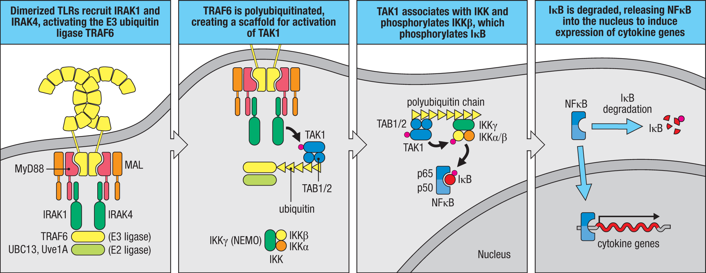
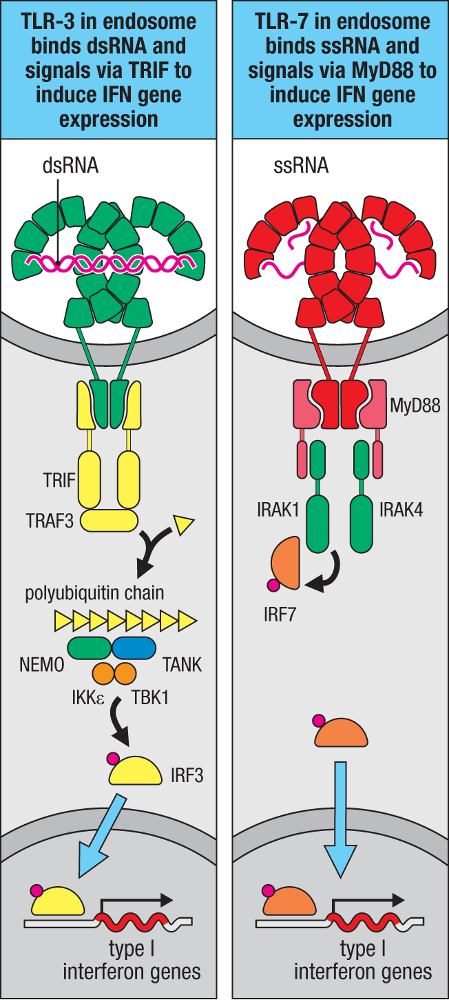
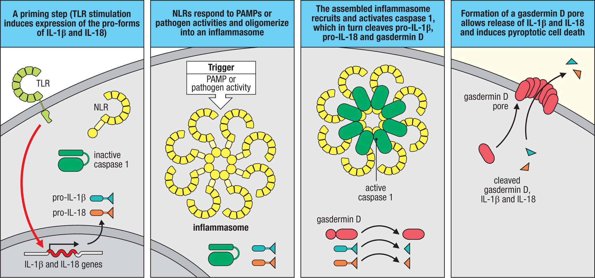

# 先天免疫訊號整合：從 TLR 到 Inflammasome 與 Interferon

> 出處：Kelly《Firestein & Kelley's Textbook of Rheumatology》Ch.95 Pathogenesis of
> Inflammasome-Mediated Diseases；Janeway《Immunobiology》10th ed Ch.3 Cellular
> Mechanisms of Innate Immunity（3-7～3-11 節，含 Fig. 3.14／3.15／3.20）。
>
> 本筆記為精華版，僅保留必背重點（🔴）。

---

## 0. 一句話看懂整章

先天免疫感應器（TLR 等）一被觸發，訊號就「分岔」：

- **MyD88 → NF-κB**：促發炎、抗細菌；同時是發炎體的「備料」步驟（priming）
- **TRIF／MyD88 → IRF**：第一型干擾素、抗病毒
- **另一條**：危險訊號 → Inflammasome → caspase-1 → IL-1β/IL-18 ＋ 焦亡

```
危險訊號 → 感應器(Sensor) → ASC → caspase-1 → IL-1β / IL-18 ＋ pyroptosis(gasdermin-D)
```

讀任何細節，先問「**這在哪條岔路？NF-κB？干擾素？還是發炎體？**」就不會迷路。

---

## 1. TLR：受體、配體與「分岔」

### 1-1. 常考的 TLR–配體配對 🔴

| TLR | 配體 | 位置 |
|---|---|---|
| TLR-3 | 雙股 RNA（病毒） | endosome |
| TLR-4 | LPS（革蘭氏陰性菌） | 細胞膜＋endosome |
| TLR-5 | 鞭毛蛋白 flagellin | 細胞膜 |
| TLR-7/8 | 單股 RNA（病毒） | endosome |
| TLR-9 | 非甲基化 CpG DNA | endosome |

### 1-2. 活化後分岔（核心觀念）🔴

配體使兩個 TLR 的胞內 **TIR 域**靠攏 → 招募 adaptor，由 adaptor 決定走哪條岔路：

- **MyD88**：大部分 TLR 用 → 走 NF-κB
- **TRIF**：只有 TLR-3 用 → 走 IRF3
- **TLR-4 兩條都走**（膜上 MyD88、進 endosome 後 TRIF）

---

## 2. NF-κB 路線＝促發炎＋發炎體 priming



三個必記重點 🔴：

1. **產物 = TNF-α、IL-1β、IL-6**，並上調 NLRP3 → 這就是發炎體的 **priming（signal 1）**
2. **IκB 被磷酸化→降解，NF-κB 才能進核**
3. 臨床鉤子：

   - **MyD88 缺乏／IRAK4 缺乏** → 反覆**細菌**感染的免疫缺陷
   - **NEMO（IKKγ）突變** → X-linked 外胚層發育不良＋免疫缺陷

---

## 3. IRF／干擾素路線＝抗病毒



### 3-1. 兩種產生第一型干擾素的走法 🔴

| 走法 | 路徑 | 主要細胞 |
|---|---|---|
| TLR-3（dsRNA） | TRIF → TBK1/IKKε → **IRF3** | DC、巨噬細胞 |
| TLR-7/8/9（ssRNA/DNA） | **MyD88 → IRAK1 → IRF7** | **漿細胞樣樹突細胞 pDC** |

🔴 高產出考點：**pDC 用 TLR-7/9 → IRF7 → 大量 IFN-α/β**，正是 **SLE「干擾素印記（interferon signature）」** 的分子根源（自體核酸進 endosome 觸發）。

### 3-2. 不經 TLR 的胞質核酸感應器 🔴

- 胞質 RNA：**RIG-I／MDA-5 → MAVS（粒線體）→ IRF3**
- 胞質 DNA：**cGAS → STING → TBK1 → IRF3**

失調或 gain-of-function → **SLE、Aicardi–Goutières 症候群、SAVI（STING 病）**等第一型干擾素病。

---

## 4. Inflammasome 發炎體




### 4-1. 主軸與下游 🔴

```
Sensor → ASC → caspase-1 → 切 pro-IL-1β / pro-IL-18 / gasdermin-D
                                              │
                          gasdermin-D N端插膜打洞 → IL-1β/IL-18 噴出 ＋ 焦亡(pyroptosis)
```

### 4-2. NLRP3：兩步驟活化（必考）🔴

- **Signal 1（priming）**＝ `TLR → MyD88 → NF-κB`（備料：pro-IL-1β、NLRP3）← 接第 2 部
- **Signal 2（activation）**＝ **K⁺ 外流 ／ 粒線體 ROS ／ 結晶造成溶酶體破裂**

### 4-3. 各 Inflammasome ↔ 疾病（速查）🔴

| 發炎體 | 感測什麼 | 對應疾病 | 主要細胞激素／治療 |
|---|---|---|---|
| **NLRP3** | 結晶、冷、代謝危險訊號（K⁺外流） | **CAPS（FCAS→MWS→NOMID）、痛風、假性痛風** | IL-1 阻斷 |
| **Pyrin (MEFV)** | actin 被細菌毒素破壞（RhoA 失活） | **FMF**、PAAND | colchicine→IL-1 |
| **MVK** | isoprenoid 缺乏 | **HIDS／MKD** | IL-1（常部分反應） |
| **NLRC4 (+NAIP)** | 細菌鞭毛蛋白／T3SS | 腸炎、**反覆 MAS** | **IL-18 阻斷** ⭐對比點 |
| **NLRP1** | 病原蛋白酶（如炭疽毒素） | **NAIAD**、皮膚角化 | IL-1 |
| **AIM2 / IFI16** | 胞質 **DNA** | 乾癬、**SLE** | —（見第 5 部） |

---

## 5. 干擾素 ✕ 發炎體：交會點 🔴

- **AIM2** 活化第一步需要第一型干擾素；**IFI16** ＝ IFN-inducible protein 16（干擾素誘導）。
- 串聯記憶：**自體 DNA → 干擾素環境 → 誘導 AIM2/IFI16 → 發炎體 → SLE**（SLE 可測 anti-AIM2／anti-IFI16）。

---

## 6. 治療 🔴

- **下游細胞激素阻斷（主流）**：

  - IL-1 阻斷：anakinra、canakinumab、rilonacept（CAPS、FMF、TRAPS、HIDS）
  - IL-18 阻斷：用於 **NLRC4** 型
- **colchicine**：FMF 第一線、痛風急性發作（機轉見下）

### colchicine 作用機轉（Kelly Ch.97）

核心：**結合 tubulin → 阻止微管（microtubule）聚合**；下游抗發炎效果都是「微管壞掉」的連鎖反應：

- **破壞發炎體組裝**：NLRP3／ASC／粒線體需沿微管聚合，微管被卡 → **NLRP3 及 Pyrin 發炎體無法活化 → caspase-1 ↓ → IL-1β ↓**（Pyrin 活化為微管依賴，故 colchicine 為 FMF 第一線）。
- **抑制嗜中性球**趨化、黏附、移行 → 跑不進關節（痛風緩解）。
- 減少白三烯、細胞激素生成與吞噬作用。

藥理（高產出）：

- **治療指數窄**，過量死亡率高。
- 經 **CYP3A4** 代謝、**P-glycoprotein（P-gp）** 排出 → 與 **clarithromycin、protease inhibitors、cyclosporine、tacrolimus、statin** 等併用會累積中毒。
- 肝／腎功能不良需減量；併用強 CYP3A4／P-gp 抑制劑為禁忌。

---

## 🎯 考前 30 秒速記

1. **TLR 一活化就分岔**：MyD88→NF-κB（發炎／priming）｜ TRIF·MyD88→IRF→干擾素（抗病毒）；TLR-4 兩條都走。
2. **pDC：TLR-7/9→IRF7→IFN** ＝ SLE 干擾素印記。
3. **發炎體主軸**：Sensor→ASC→caspase-1→IL-1β/IL-18＋焦亡。
4. **NLRP3 兩步驟**：signal 1 priming(NF-κB 備料)｜signal 2(K⁺外流/ROS/溶酶體破裂 點火)。
5. **疾病配對**：NLRP3→CAPS/痛風｜Pyrin→FMF｜MVK→HIDS｜NLRC4→MAS(IL-18)｜AIM2/IFI16→SLE。
6. **用藥**：多靠 IL-1 阻斷；NLRC4 型靠 IL-18；FMF 用 colchicine。
